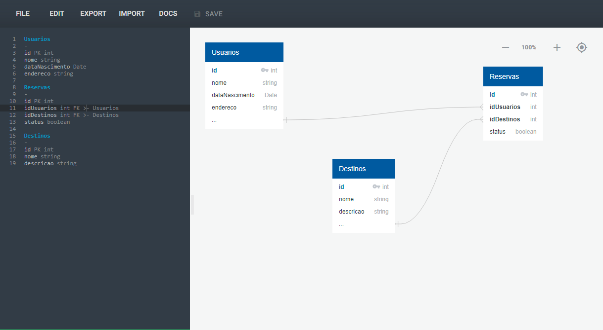

# Introdução a Banco de Dados Relacionais (SQL)

Banco de dados é uma coleção de dados estruturados que seguem a estrutura de tabelas e que formam relações entre estes dados.

A estrutura de um banco de dados se dividem em tabelas, como todas as tabelas elas possuem colunas que por sua vez têm linhas ou Tuplas que comportam os dados deste banco. Cada tabela no banco de dados possuem chaves primárias e chaves estrangeiras que é o recurso utilizado para relacionar esses dados dentro do BD.

## SQL - Strutured Query Language

O SQL é uma linguagem padronizada de consulta ao banco de dados amplamente utilizada nos SGBDs.

Ela se organiza em 3 principais linguagens que definem as operações CRUD.

Essas outras duas linguagens também fazem parte da organização da SQL, mas não são tão utilizadas.

### Sintaxe básica: Nomeclatura

Os nomes de colunas em um BD devem seguir algumas regras básicas de sintaxe.
* Os nomes devem começar com uma letra ou com um caractere de sublinhado (_)
* Os nomes podem conter letras, números e caracteres de sublinhado(_)
* Sensibilidade a maiúsculas e minúsculas

## MER e DER: Modelagem de Banco de Dados

* **MER - Modelo Entidade-Relacionamento**
É um modelo utilizado para representar a estrutura geral de um Banco de Dados.
* **DER - Diagramas Entidade-Relacionamento**
É um modelo utilizado para representar de maneira gráfica esta estrutura do Banco de Dados.

### Entidades

As entidade são nomeadas com substantivos concretos ou abstratos que representem de forma clara sua função dentro do domínio.

As entidades são os nomes das nossas tabelas e são representadas pelos retângulos em nosso diagrama.
É muito importante que os nomes destas entidades não sejam ambíguos.

### Atributos

Os atributos são as características ou propriedades das entidades. Eles descrevem informações específicas sobre uma entidade.

Os atributos são os representados pelas elipses e representam as colunas em nosso banco de dados. Os atributos também não devem ser ambíguos, para que não haja um atributo composto de várias informações.
As elipses por sua vez poluem muito o nosso diagrama, portanto hoje em dia é amplamente utilizado o padrão UML.

### Relacionamentos

Os relacionamentos representam as associações entre entidades e eles descrevem como elas se relacionam entre si.

Os relacionamentos sempre são representados por um losango e é muito importante que este relacionamento descreva o que ele realiza.
Neste caso temos o exemplo da entidade `usuarios` que **realiza** uma `reservas` e esta se **vincula** a um `destinos` .

### Cardinalidade

A Cardinalidade descreve a forma como as entidades se relacionam umas com as outras, ou seja, indica o número máximo de instancias ou ocorrência que podemos ter de uma entidade associada a outra.

Existem alguns tipos de cardinalidade:
* Relacionamento 1..1 (um para um)
* Relacionamento 1..n ou 1..* (um para muitos)
* Relacionamento n..n ou *..* (muitos para muitos)

Podemos observar que a `reservas` tem um relacionamento de **1 para 1** com o `usuarios`, pois não faz sentido que a reserva tenha mais de um `usuarios`, mas um único `usuarios` pode ter várias `reservas`, por isso o relacionamento de `usuarios` para `reservas` é de **0 para n** já que o usuário pode ter nenhuma ou n `reservas`.

### Quick DBD

Tamos a nossa disposição uma ferramenta que utiliza a linguagem escrita para modelar os diagramas do nosso Banco de Dados de maneira mais rápida.

[Quick DBD](https://app.quickdatabasediagrams.com/)

Vide documentação para mais detalhes sobre a linguagem.

## Configuração do Ambiente

Estaremos utilizando o MariaDb 10.3.39 rodando em uma máquina virtual Linux Ubuntu server 22.04.3 LTS

Siga as intruções das documentações abaixo

1. Instale o Ubuntu Server
2. [Inicializando senha de usuário root](https://www.cyberciti.biz/faq/change-root-password-ubuntu-linux/)
3. [Configurações iniciais de segurança](https://www.digitalocean.com/community/tutorials/initial-server-setup-with-ubuntu-20-04)
4. [Instalando MariaDB no servidor](https://www.digitalocean.com/community/tutorials/how-to-install-mariadb-on-ubuntu-20-04)
5. [Abrindo portas no Firewall](https://99rdp.com/how-to-open-a-port-in-ubuntu-20-04/)
6. [Configurando MariaDB para acesso remoto](https://mastigado.wordpress.com/2013/11/20/liberando-seu-mysql-para-acesso-externo/)

# Modelagem de Dados Relacionais

Estaremos utilizando o [DBeaver 24.1.3](https://dbeaver.io/) para realização dos exemplos a seguir.

* **Tabelas**
Ela é usada para armazenar dados de forma organizada. Cada tabela em um banco de dados relacional tem um nome único e é dividida em colunas e linhas.

* **Colunas**
Uma coluna é uma estrutura dentro de uma tabela que representa um atributo específico de dados armazenados. Cada coluna tem um nome único e um tipo de dado associado que define o tipo de informação que pode ser armazenado nela, como números, textos, datas, etc.

* **Registros**
Um registro, também conhecido como linha ou tupla, é uma instância individual de dados em uma tabela.

## Tipos de Dados

Os dados podem variar muito entre os diversos SGBDs, os mais comuns são:
* Inteiro(Integer)
* Decimal/Numérico (Decimal/Numeric)
* Caractere/Varchar (Character/Varchar)
* Data/Hora (Date/Time)
* Booleano (Boolean)
* Texto longo (Text)

## Criando uma Tabela no Banco de dados

Para criar uma tabela no banco de dados utilizamos o comando `CREATE TABLE` que possui algumas opções para sua modificação.

* **Opções**
    * Restrições de valor:
        * NOT NULL
        Indica que o campo é obrigatório
        **Ex.** *Campo de nome de usuário*
        * UNIQUE
        Indica que o campo é unico dentro da tabela
        **Ex.** *Email de cadastro do usuário*
        * DEFAULT
        Indica um valor padrão para ser atribuido no momento da criação
        **Ex.** *Status de uma reserva de hotel como Aberta(Boolean)*
    * Chaves primárias e estrangeiras
    * Auto Incremento

Vamos criar um banco de dados de uma agência de viagens para exemplificar os comandos de criar tabelas.

1. Crie um novo Banco de dados

2. Dê um nome para este banco

3. Clique com o botão direito no banco criado
4. Vá até **Editor SQL** e clique em **Abrir Script SQL**

Nesta query SQL criamos uma tabela `usuarios` e como vimos anteriormente, utilizamos as opções para definir que estes campos são obrigatórios.

Também criaremos as tabelas `destinos` e `reservas`. Note que aqui utilizamos a opção `DEFAULT` na coluna `status` que já atribui o valor **'pendente'** a ela para que sempre seja o valor padrão caso este não seja passado.

Por fim teremos esta estrutura em nosso banco de dados.
