# Introdução a Banco de Dados Relacionais (SQL)

Banco de dados é uma coleção de dados estruturados que seguem a estrutura de tabelas e que formam relações entre estes dados.

A estrutura de um banco de dados se dividem em tabelas, como todas as tabelas elas possuem colunas que por sua vez têm linhas ou Tuplas que comportam os dados deste banco. Cada tabela no banco de dados possuem chaves primárias e chaves estrangeiras que é o recurso utilizado para relacionar esses dados dentro do BD.

## SQL - Strutured Query Language

O SQL é uma linguagem padronizada de consulta ao banco de dados amplamente utilizada nos SGBDs.

Ela se organiza em 3 principais linguagens que definem as operações CRUD.

Essas outras duas linguagens também fazem parte da organização da SQL, mas não são tão utilizadas.

### Sintaxe básica: Nomeclatura

Os nomes de colunas em um BD devem seguir algumas regras básicas de sintaxe.
* Os nomes devem começar com uma letra ou com um caractere de sublinhado (_)
* Os nomes podem conter letras, números e caracteres de sublinhado(_)
* Sensibilidade a maiúsculas e minúsculas

## MER e DER: Modelagem de Banco de Dados

* **MER - Modelo Entidade-Relacionamento**
É um modelo utilizado para representar a estrutura geral de um Banco de Dados.
* **DER - Diagramas Entidade-Relacionamento**
É um modelo utilizado para representar de maneira gráfica esta estrutura do Banco de Dados.

### Entidades

As entidade são nomeadas com substantivos concretos ou abstratos que representem de forma clara sua função dentro do domínio.

As entidades são os nomes das nossas tabelas e são representadas pelos retângulos em nosso diagrama.
É muito importante que os nomes destas entidades não sejam ambíguos.

### Atributos

Os atributos são as características ou propriedades das entidades. Eles descrevem informações específicas sobre uma entidade.

Os atributos são os representados pelas elipses e representam as colunas em nosso banco de dados. Os atributos também não devem ser ambíguos, para que não haja um atributo composto de várias informações.
As elipses por sua vez poluem muito o nosso diagrama, portanto hoje em dia é amplamente utilizado o padrão UML.

### Relacionamentos

Os relacionamentos representam as associações entre entidades e eles descrevem como elas se relacionam entre si.

Os relacionamentos sempre são representados por um losango e é muito importante que este relacionamento descreva o que ele realiza.
Neste caso temos o exemplo da entidade `usuarios` que **realiza** uma `reservas` e esta se **vincula** a um `destinos` .

### Cardinalidade

A Cardinalidade descreve a forma como as entidades se relacionam umas com as outras, ou seja, indica o número máximo de instancias ou ocorrência que podemos ter de uma entidade associada a outra.

Existem alguns tipos de cardinalidade:
* Relacionamento 1..1 (um para um)
* Relacionamento 1..n ou 1..* (um para muitos)
* Relacionamento n..n ou *..* (muitos para muitos)

Podemos observar que a `reservas` tem um relacionamento de **1 para 1** com o `usuarios`, pois não faz sentido que a reserva tenha mais de um `usuarios`, mas um único `usuarios` pode ter várias `reservas`, por isso o relacionamento de `usuarios` para `reservas` é de **0 para n** já que o usuário pode ter nenhuma ou n `reservas`.

### Quick DBD

Tamos a nossa disposição uma ferramenta que utiliza a linguagem escrita para modelar os diagramas do nosso Banco de Dados de maneira mais rápida.

[Quick DBD](https://app.quickdatabasediagrams.com/)

Vide documentação para mais detalhes sobre a linguagem.

## Configuração do Ambiente

Estaremos utilizando o MariaDb 10.3.39 rodando em uma máquina virtual Linux Ubuntu server 22.04.3 LTS

Siga as intruções das documentações abaixo

1. Instale o Ubuntu Server
2. [Inicializando senha de usuário root](https://www.cyberciti.biz/faq/change-root-password-ubuntu-linux/)
3. [Configurações iniciais de segurança](https://www.digitalocean.com/community/tutorials/initial-server-setup-with-ubuntu-20-04)
4. [Instalando MariaDB no servidor](https://www.digitalocean.com/community/tutorials/how-to-install-mariadb-on-ubuntu-20-04)
5. [Abrindo portas no Firewall](https://99rdp.com/how-to-open-a-port-in-ubuntu-20-04/)
6. [Configurando MariaDB para acesso remoto](https://mastigado.wordpress.com/2013/11/20/liberando-seu-mysql-para-acesso-externo/)

# Modelagem de Dados Relacionais

Estaremos utilizando o [DBeaver 24.1.3](https://dbeaver.io/) para realização dos exemplos a seguir.

* **Tabelas**
Ela é usada para armazenar dados de forma organizada. Cada tabela em um banco de dados relacional tem um nome único e é dividida em colunas e linhas.

* **Colunas**
Uma coluna é uma estrutura dentro de uma tabela que representa um atributo específico de dados armazenados. Cada coluna tem um nome único e um tipo de dado associado que define o tipo de informação que pode ser armazenado nela, como números, textos, datas, etc.

* **Registros**
Um registro, também conhecido como linha ou tupla, é uma instância individual de dados em uma tabela.

## Tipos de Dados

Os dados podem variar muito entre os diversos SGBDs, os mais comuns são:
* Inteiro(Integer)
* Decimal/Numérico (Decimal/Numeric)
* Caractere/Varchar (Character/Varchar)
* Data/Hora (Date/Time)
* Booleano (Boolean)
* Texto longo (Text)

## Criando uma Tabela no Banco de dados

Para criar uma tabela no banco de dados utilizamos o comando `CREATE TABLE` que possui algumas opções para sua modificação.

* **Opções**
    * Restrições de valor:
        * NOT NULL
        Indica que o campo é obrigatório
        **Ex.** *Campo de nome de usuário*
        * UNIQUE
        Indica que o campo é unico dentro da tabela
        **Ex.** *Email de cadastro do usuário*
        * DEFAULT
        Indica um valor padrão para ser atribuido no momento da criação
        **Ex.** *Status de uma reserva de hotel como Aberta(Boolean)*
    * Chaves primárias e estrangeiras
    * Auto Incremento

Vamos criar um banco de dados de uma agência de viagens para exemplificar os comandos de criar tabelas.

1. Crie um novo Banco de dados

2. Dê um nome para este banco

3. Clique com o botão direito no banco criado
4. Vá até **Editor SQL** e clique em **Abrir Script SQL**

Nesta query SQL criamos uma tabela `usuarios` e como vimos anteriormente, utilizamos as opções para definir que estes campos são obrigatórios.

Também criaremos as tabelas `destinos` e `reservas`. Note que aqui utilizamos a opção `DEFAULT` na coluna `status` que já atribui o valor **'pendente'** a ela para que sempre seja o valor padrão caso este não seja passado.

Por fim teremos esta estrutura em nosso banco de dados.

## Operações CRUD

CRUD é o acrônimo para Create (criar), Read (ler), Update (atualizar) e Delete (apagar). Com essa explicação, já dá para intuir que o CRUD é uma sequência de funções de um sistema que trabalha com banco de dados, seja ele na sua máquina ou na nuvem.

### Comando: INSERT

Este é o comando responsável por inserir dados nas tabelas em nosso banco de dados. Tal comando corresponde ao **C (Create)** das operações CRUD.

A operação de **INSERT** serguirá esta estrutura, sendo a clausula `INSERT INTO` obrigatória em todas as operações de **INSERT**, entre parenteses seguirá a ordem de colunas estabelecida na criação da nossa tabela.
Após definir a sequencia em que nossos dados serão inseridos, seguimos para a clausula `VALUES`, onde será inserido o dado em sí na sequencia definida na clausula anterior.

Executando essa Query será inserido nosso primeiro usuário no banco.
_Note que inserimos o **ID** manualmente pois não definimos auto-incremento para a coluna **ID** ainda._

Vamos também inserir um `destino` e uma `reserva` em nosso banco.
_Como também não definimos uma relação entre as tabelas, ainda é possível inserir dados que podem ainda não existir em nosso banco, como o **ID** de um usuário ou destino que ainda não existem no banco._

Ao executar a query teremos os seguintes dados inseridos nas tabelas `destinos` e `reservas`.

### Comando: SELECT

Este comando é responsável por realizar uma leitura no banco de dados. Tal comando corresponde ao **R (Read)** das operações CRUD.

A clausula `SELECT` sempre será seguida das colunas que queremos que o banco retorne, caso queira retornar todas as colunas da tabela selecionada utilizamos `*`.
Já na clausula `FROM` é onde vamos indicar a tabela que queremos reslizar uma consulta.

#### Comando: SELECT com WHERE

Grande parte das consulas que fazemos em um banco de dados nos trazem uma grande quantidade de dados, portanto não faz sentido que façamos uma consulta no banco de dados completo. Para isso utilizamos a clausula `WHERE` para filtrar dentro de determinada condição apenas os dados que desejamos consultar no banco de dados.

**Operadores do comando WHERE**
* Igualdade (=)
* Desigualdade (!= ou <>)
* Maior que (>)
* Menor que (<)
* Maior ou igual (>=)
* Menor ou igual (<=)
* BETWEEN (entre um intervalo de valores)
* IN (dentro de uma lista de valores)
* LIKE (para buscas com padrões)
    * O caractere % substitui zero ou mais caracteres.
    * O caractere _ substitui um único caractere.
* IS NULL / IS NOT NULL (verifica valores nulos)
* AND (para combinar múltiplas condições)
* OR (para combinar múltiplas condições)
* NOT (para negar uma condição)

Para nosso exemlo de `SELECT` com `WHERE` vamos inserir alguns dados em nossas tabelas para que nosso exemplo faça sentido.

##### WHERE por id

Neste exemplo utilizamos a clausula `WHERE` para encontrar todos os usuários com `id` 1 que existem na tabela `usuarios`. Tal comando servirá para encontrar qualquer informação específica no banco de dados.

##### WHERE com LIKE

A Clausula `LIKE` é utilizada para fazer uma consulta em que determinado tipo de dado esteja presente. Neste exemplo o banco nos retorna todos as linhas que tenham presentes a letra **S** na coluna nome.

##### WHERE com AND e OR

Podemos utilizar o operador **AND** para criar uma condição onde será selecionado tudo que tiver `id = 1` **E** `nome LIKE "%João%"`.
A Clausula `LIKE` vai selecionar tudo que corresponder a string dentro do banco de dados.

Já na condicional **OR** selecionamos todos os dados que correpondam ao `id = 1` **OU** ao `nome LIKE "%Maria%"`, nos retornando os dois valores que correspondem a esta condição.

### Comando: UPDATE

Este comando é responsável por realizar uma atualização de algum dado dentro do banco de dados. Como o nome já diz, **UPDATE** corresponde à letra **U** do acrônimo CR**U**D.

Ao fazer um **UPDATE** em um banco de dados, é **MUITO IMPORTANTE** que tenha a clausula **WHERE** acompanhada sempre.

Nesta query fizemos um Update em `id`. Na clausula **WHERE** note que fornecemos a ela um email, que corresponde ao email dentro de nosso banco de dados, portanto onde houver o email `pedro@example.com` o `id` receberá o valor `4`.

**Tenha bastante cautela ao executar este tipo de query, pois ela pode causar perda permanete dos dados.**

### Comando: DELETE

Por fim temos a última operação do CRU**D**, **DELETE** é responsável por apagar um dado dentro de uma tabela.

Ao fazer um **DELETE** em um banco de dados, é **MUITO IMPORTANTE** que tenha a clausula **WHERE** acompanhada sempre.

Nesta query vamos deletar pelo nome, portando a clausula `WHERE nome = "Praia do Rosa"` vai receber o caminho de onde este **DELETE** vai acontecer.

**Tenha bastante cautela ao executar este tipo de query, pois ela pode causar perda permanete dos dados.**

## Alterando e Excluindo Tabelas

Apesar do banco de dados ter uma estrutura rígida eles possuem uma flexibilidade bem grande, podendo alterar e excluir tabelas para melhor modelagem deste banco.

Vamos abstrair um problema para exemplificar os comando a seguir:

**Problema**
Usuários com endereços longos não estão conseguindo realizar cadastro no sistema

Opções
* Recriar a tabela, migrar os dados e excluir a tabela anterior
* Alterar estrutura da tabela

### Migrando dados de uma tabela

Vamos criar uma nova tabela para fazermos nossas alterações nela.

Também vamos migrar os dados da tabela `usuarios` para nossa nova tabela com o comando **INSERT INTO**

### Comando: DROP TABLE

O comando **DROP TABLE** é usado no SQL para remover uma tabela existente de um banco de dados relacional.
_**Ele exclui permanetemente a tabela.**_

Após nos certificarmos que os dados da tabela antiga foram migrados para a nova tabela.

Podemos então utilizar o **DROP TABLE** para excluir a antiga tabela ´usuarios´.

Será mostrada uma mensagem perguntando se tem certeza, pois se trata de uma ação permanente.

### Comando: ALTER TABLE

A cláusula **ALTER TABLE** é usada no SQL para modificar a estrutura de uma tabela existente em um banco de dados relacional.

Ela permite:
* Adicionar, alterar ou excluir colunas
* Modificar as restrições, índices
* Renomear a tabela entre outras alterações

Após migrados os dados da antiga para a nossa nova tabela, podemos por fim alterar o seu nome.

Utilizamos a cláusula **RENAME** para definir o novo nome da nossa tabela.

Se verificarmos a estrutura do nosso banco, podemos observar que o `varchar` de `endereco` agora comporta 100 caracteres ao invés de 50 como definido anteriormente.

Também podemos alterar apenas o tamanho da coluna, com a cláusua `MODIFY COLUMN` passando o nome da tabela e sua alteração.

## Chaves Primárias e Estrangeiras

**Chaves Primárias**
Chaves primárias são campos de dados únicos que servem para garantir a integridade dos nossos dados de forma que não haja dados duplicados dentro da nossa tabela.

* Identifica exclusivamente
* Não pode conter valores nulos (NULL)
* Uma tabela pode ter apenas uma chave primária

**Chaves Estrangeiras**
Chaves estrangeiras são chaves responsáveis por relacionar uma tabela a outra dentro do banco de dados. Ela é usada para estabelecer e manter a integridade dos dados entre tabelas relacionadas.

* Pode ser nula (NOT NULL) **registro órfão*
* É possível ter mais de uma (ou nenhuma) em uma tabela

**Restrições das chaves estrangeiras**
São restrições que especificam o que acontece com aquele registro quando um registro pai é apagado, atualizado, etc.

* ON DELETE especifica o que acontece com os registros dependentes quando um registro pai é excluido.
* ON UPDATE define o comportamento dos registros dependentes quando um registro pai é atualizado.
* CASCATE, SET NULL, SET DEFAULT e RESTRICT

### Chave Primária

Vamos criar novas tabelas e definir suas chaves primárias.

Aqui criamos as tabelas com o `id` sendo nossa chave primária, note que ao migrar os dados na cláusula `INSERT INTO`, não houve a necessidade de migrar o campo `id`, pois o mesmo foi definido como `AUTO_INCREMENT`.

Outra opção seria apenas alterar o campo `id` o adicionando como chave primária.

Estas alterações garantem que cada dado dentro do banco de dados tenha um `id` único e que nunca se repete.

### Chave Estrangeira

Vamos agora criar uma tabela e definir as chaves estrangeiras.

A cláusula `FOREIGN KEY` é responsável por definir qual coluna será a chave estrangeira e com `REFERENCES` definimos a que coluna de outra tabela ela está se relacionando.
Atente-se para o nome da sua `CONSTRAINT` pois se outra tabela já for criada com o nome dela havera um conflito de chave duplicada.

Também é possível alterar uma tabela transformando a coluna em uma coluna de chave estrangeira.

#### Restrições de chaves estrangeiras

Vamos adicionar uma restrição de exclusão em cascata a uma chave estrangeira.

Primeiramente vamos apagar a restrição já existente para só então adicionarmos uma nova e ao final desta adição utilizamos a cláusula `ON DELETE CASCADE`.
Desta forma se excluirmos um usuário no banco de dados, todos os dados relacionados a ele em nosso banco será deletado também.

## Normalizaçãao de dados

A normalização de dados é um processo no qual se organiza e estrutura um banco de dados relacional de forma a eliminar redundâncias e anomalizas, garantindo a consistência e integridade dos dados.

Para exemplificar esta sessão vamos asbtrair um problema na modelagem do nosso banco de dados até o momento.

**Problema:**
Após colocarmos nosso banco de dados em produção, surgiu a necessidade de criar uma nova feature com a função de sugerir destinos com base nas cidades dos usuários.
Podemos notar que em nossa tabela, deixamos que o campo de endereço seja escrito livremente sem distinção do que é cidade, estado e endereço da casa.

### Formas Normais

#### 1FN: Atomicidade de dados
A 1FN estabelece que cada valor em uma tabela deve ser atômico, ou seja, indivisível. Nenhum campo deve conter múltiplos valores ou listas. No seu caso, o campo `endereco` contém múltiplos valores, como rua, número, cidade e estado. Para atingir a 1FN, precisamos dividir o campo `endereco` em colunas separadas.

##### Normalizando tabela de endereços

Para normalizar nossa tabela `endereco` de acordo com o diagrama, vamos criar as colunas correspondentes.

Após a criação das colunas, é necessário um script para migrar nossos dados da coluna `endereco` para as novas colunas criadas. Assim como numa linguagem de programação, utilizaremos `SUBSTRING` para fazermos este script.

Como seguimos um padrão de endereço separado por vírgula, podemos escrever um script que identifique este padrão. Tal script vai primeiro identificar o que está atrás da primeira vírgula e atribuir à coluna `rua` e assim sucessivamente até chegar na última separação.

Por fim apagamos nossa coluna `encereco` para finalizar nossa normalização dos dados em colunas separadas garantindo a atomicidade dos dados e estabelecendo a **1FN**.

#### 2FN

Formas Normais são sempre incrementais, portanto para que uma tabela seja normalizada de acordo com a segunda forma normal (2FN) ela obrigatóriamente tem de estar de acordo com a primeira forma normal (1FN).

A 2FN garante que os atributos não chave dependam totalmente da chave primária, evitando dependências parciais.

* A 2FN estabelece que uma tabela deve estar na 1FN
* Todos os atributos não chave devem depender totalmente da chave primária.

Se sua tabela tem uma **chave primária simples** não existe a possibilidade de termos dependência parcial e portanto ela já se encontra na 2FN.

#### 3FN

A 3FN elimina dependências transitivas entre os atributos não chave, garantindo que cada atributo não chave dependa apenas da chave primária, não havendo dependências indiretas entre eles.

* Uma tabela deve estar na 2FN
* Nenhuma coluna não-chave deve depender de outra coluna não-chave

Nosso exemplo: Relação Estado -> Cidade

# Consultas avançadas

Em sistemas mais complexos precisamos faazer consultas no banco de dados de modo  que as tabelas sejam agregadas umas as outras.

## Junções: JOINs

São usadas no SQL para combinar daddos de duass ou mais tabelas relacionadas em uma única consulta.

### INNER JOIN

Retorna apenas as linhas que têm corresspondência em ambas as tabelas envolvidas na junção. A junção é feita com  baase em uma condição de igualdade especificaada na cláusula ON.

Nesta consulta estamos mesclando todos os dados de `id` de `usuario` que correspondem a `id_usuario` na tabela de `reservas`.

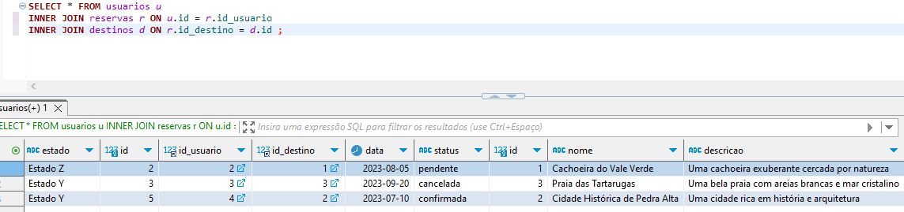
Também podemos trazer dados de `destinos` relacionanddo a coluna `reservas`.

### LEFT JOIN

Retorna todas as linhas da tabela à  esquerda da junção e as linhas correspondentes da tabela à direita. Se não houver correspondência, os valores da tabela à direita serão NULL.

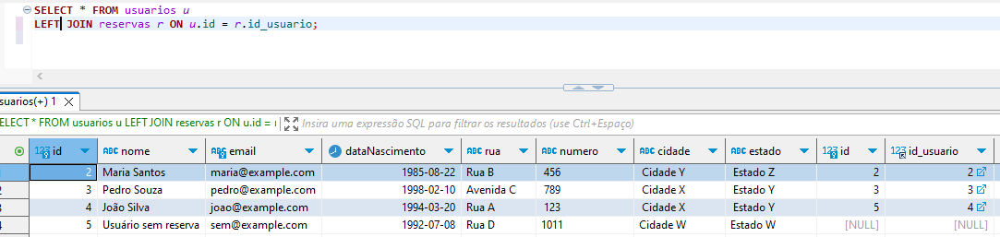
Diferente do INNER JOIN, o LEFT JOIN vai sim retornar valores que não fazem relação com outras tabelas, trazendo esses dados como NULL.

### RIGHT JOIN

Retorna todas as linhas da tabela à direita da junção e as linhas correspondentes da tabela à esquerda. Se  não houver correspondência, os valores da tabela à esquerda serão NULL.

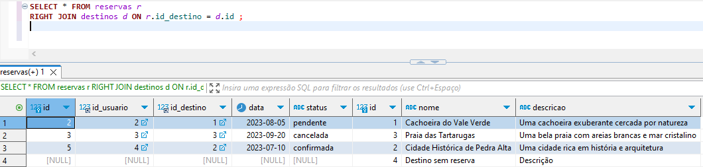
Ao contrario do LEFT JOIN, no INNER JOIN temos os valores a direita sendo consultados e onde não tem relação ficará NULL a esquerda.

## Sub Consultas

Elas permitem realizar consultas mais complexas permitindo que você use o resultado de uma consulta como entrada para outra consulta.

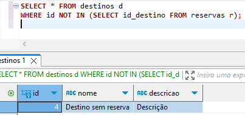
Aqui temos uma consulta que vai nos retornar o `id` que não está presente em reservas. Nos retornando neste caso o destino que não possui reservas.

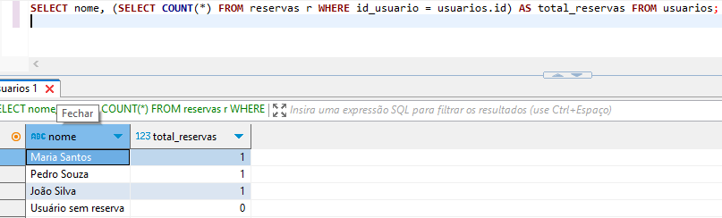
Aqui temos outro exemplo  de sub consulta, desta vez nos retornando  a quantidade de reservas que  cada usuário tem.

## Funções agregadas

São  funções responsáveis  por realizar  um  pre processamento ou calculo em nossas consultas no banco de dados.

Essas funções são:
* **COUNT**: Conta o  número de  registros
* **SUM**: Soma os valores de uma coluna numérica
* **AVG**: Calcula a média dos valores de uma coluna numérica
* **MIN**: Retorna o valor mínimo de uma coluna
* **MAX**: Retorna o valor máximo de uma coluna

### COUNT
Utilizamos o COUNT quando precisamos contar valores presentes nas tabelas do banco de dados.

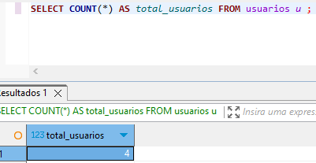
Aqui temos uma consulta na qual  contamos o número de usuários presentes no banco de dados.

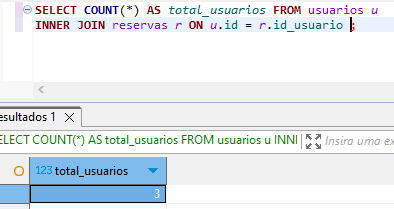
Combinando esta consulta com um INNER JOIN, temos o número de usuários que possuem reservas.

### MAX
Utilizamos o MAX quando precisamos que banco  nos retorne o maior valor  contido na tabela.

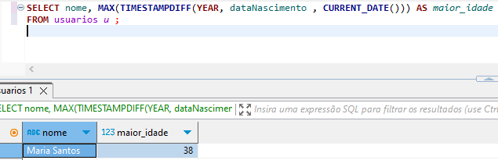
Nesta consulta utilizamos a função `TIMESTAMPDIFF`  que realiza a diferença entre as datas, neste caso estamos  realizando a diferença de ano entre a idade do usuário no banco com o  ano atual do sistema, retornando assim a idade do usuário.

## Agrupamento de Resultados

O agrupamento de resultados serve para que possamos agrupar os valores de uma tabela de acordo com uma determinada condição.

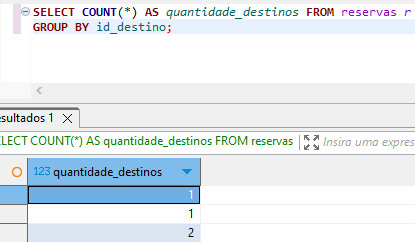
Nesta consulta  agrupados as reservas por destinos e contamos  quantos destinos  cada reserva possui.

## Ordenação de Resultados

A ordenação é uma função muito comum bastante utilizada em consultas no banco de dados, na  maioria das vezes queremos que os dados sejam retornados de forma ordenada, seja de forma crescente ou decrescente.

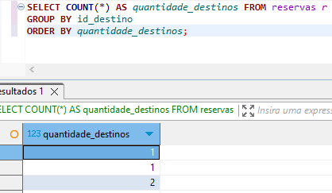
Por padrão o ORDER BY sempre vai nos trazer os valores de forma ascendente, ou seja do menor para o maior.

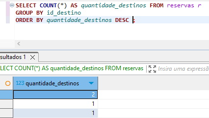
Caso seja necessário que a ordenação seja de forma descendente, utilizamos a cláusula `DESC` para que o  ressultado  seja do  maior para o menor.

# Spring Framework

Framework open source desenvolvido para plataforma Java baseado nos padrões de projetos inversão de controle e injeção de dependência.

Sua estrutura é composta por módulos afins de  reduzir a  complexidade  no desenvolvimento de aplicações  simples e corporativas.

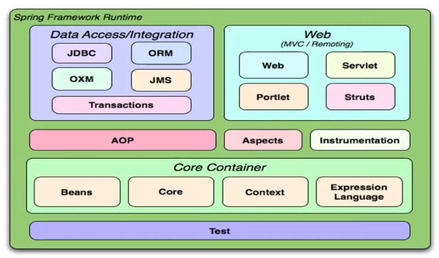

## Inversão de Controle

Inversion of Control  ou IoC, trata-se  do redirecionamento de fluxo de execução  de um  código retiranddo parcialmente o controle sobre ele  e  delegando-o para um container.
O principal propósito é minimizar o acoplamento de código.

**Sem IoC**
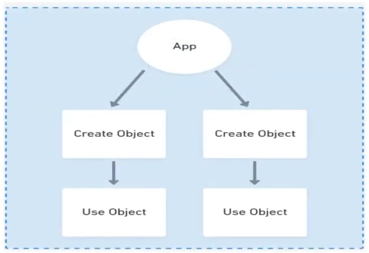
Antes do IoC nossa aplicação era inicializada  e teriamos de inicializar o objeto antes  de  utiliza-lo.

**Com IoC**
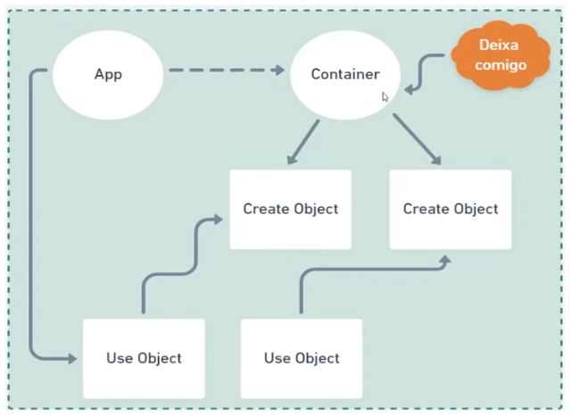
Com o IoC inicializamos nossa aplicação e é criado um container, este container já possui todos os objetos inicializados e prontos para serem utilizados.

## Injeção de Dependências

Injeção de dependência  é um  padrão de desenvolvimento com a finalizade de manter baixo  o nível de acoplamento entre  módulos de um sistema.

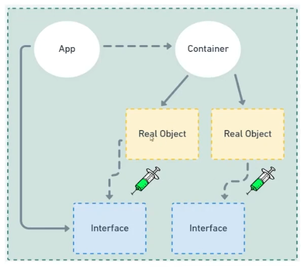

## Beans

O objeto que é instanciado (criado), montado e gerenciado por um container através do  princípio da inversão de controle.

## Scopes

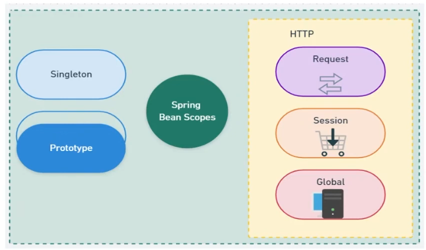

### Singleton

O contêiner do Spring IoC define apenas uma instância do objeto.

### Prototype

Será criado um novo objeto a cada solicitação ao container.

### HTTP - Request

Um bean será criado para cada requisição HTTP.
*Os objetos existirão enquanto a requisição estiver em execução.*

### HTTP - Session

Um bean será criado para  a sessão de usuário.
*Precisamos acessar a mesma solicitação duas vezes para testar os escopos específicos da web.*

### HTTP - Global

Ou Application Scope cria um bean para o ciclo de vida do contexto da aplicação.
*Objetos compartilhados por toda a aplicação.*

## Autowired

Uma anotação (indicação) onde deverá ocorrer  uma  injeção  automática de  dependência.

* **byName**: É buscado  um método set que corresponde ao nome do Bean.
* **byType**: É considerado  o  tipo de classe para inclusão do Bean.
* **byContrutor**: Usamos o construtor para incluir a dependência.

# Spring Boot

Enquanto que o Spring Framework é baseado no padrão de injeção de dependências, o Springboot foca na configuração automática.

Dado  que a maior parte das configurações  necessárias para o início de um projeto são sempre as mesmas, por que não iniciar um projeto com todas estas configurações já definidas?

## Starters

Starters são descritores de dependências  que  diminuem a verbosidade do código em que declaramos quais dependências iremos utilizar em nosso projeto.

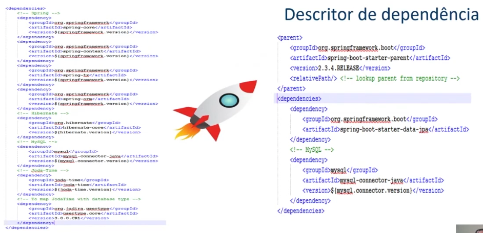
Com o Spring Framework precisariamos ddeclarar cada dependência utilizada pelo nossso  projeto, mas com os Starters utilizamos  o Descritor de dependência onde declaramos apenas que utilizamos  o Spring Boot e ele se encarrega de carregar todas as dependências utilizadas. 
Com os Starters devemos nos preocupar apenas com as  dependências que não são garantidas  pelo framework,  como a dependência de **MySQL** declarada.

**Benefícios**
* Coesão
* Versões compatíveis
* Otimização  de  tempo
* Configuração simples
* Foco no  negócio

### Alguns Starters

__Spring-boot-starter-*__
* **data-jpa**: Integração ao banco de dados via JPA - Hibernate.
* **data-mongodb**: Integração  com banco de dados MongoDB.
* **web**: Inclusão do container Tomcat para aplicações REST.
* **web-services**: Webservices baseados  na arquitetura SOAP.
* **batch**: Implementação de JOBs de processos.
* **test**:  Disponibilização de  recursos para testes unitários como JUnit.
* **openfeign**: Client HTTP baseado em interfaces.
* **actuator**: Gerenciamento de monitoramento da aplicação.

## Primeiros Passos

Vamos agora para os primeiros passos para conhecer um projeto Spring Boot

### Criando projeto com Initializr

Precisamos primeiramente acessar o site do [Spring Initializr](https://start.spring.io/).

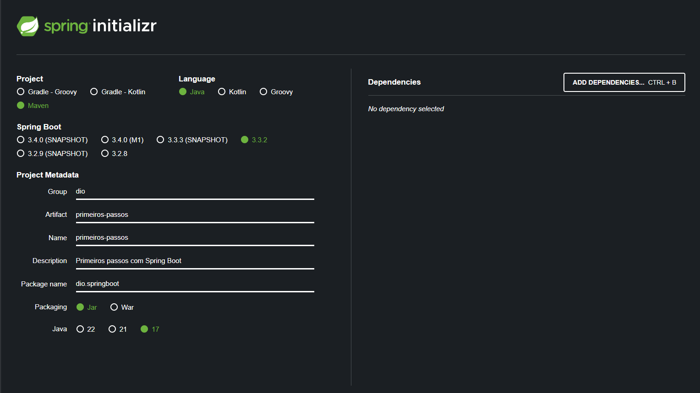
Nesta página é onde vamos definir a estrutura do  nosso projeto, linguagem utilizada, a versão do framework, dependências (Starters) e dos dados de nosso projeto conforme a necessidade de cada projeto.

### Importando o projeto maven no IntelliJ

Após gerar o projeto Spring Boot, teremos um arquivo zip com nosso projeto onde podemos extraí-lo em uma pasta e assim faremos a abertura deste projeto no IntelliJ.

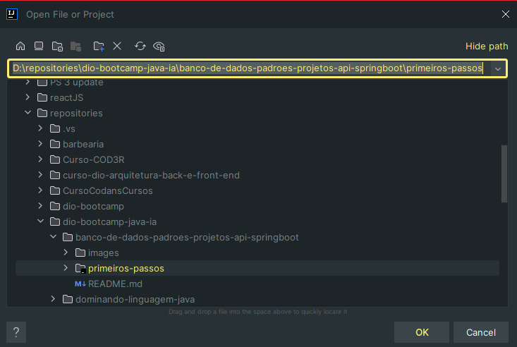

### Conhecendo a estrutura Spring Boot

Em nosso projeto teremos uma estrutura padrão de um proveto Maven, onde nossos arquivos principais estarão  localizados em na pasta `src/main/java`.

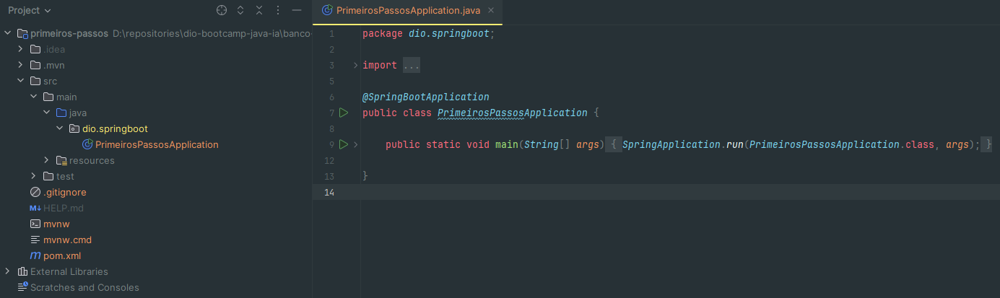
Dentro do  arquivo principal teremos a indicação que este é  um  projeto Spring Boot `@SpringBootApplication` e a declaração de inicialização do  projeto `SpringApplication.run(PrimeirosPassosApplication.class, args)`.

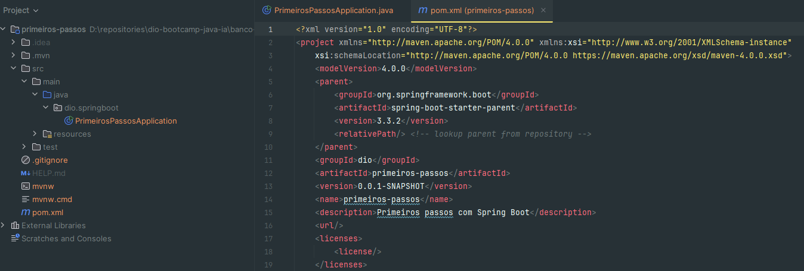
Teremos também o arquivo `pom.xml` que é onde ficam nossas Starters com as declarações de dependências do  nosso projeto.

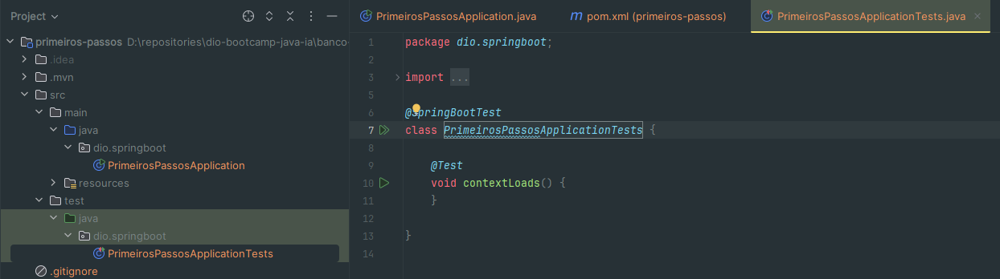
Também teremos uma classe para testes que será utilizada  em contextos de TDD.

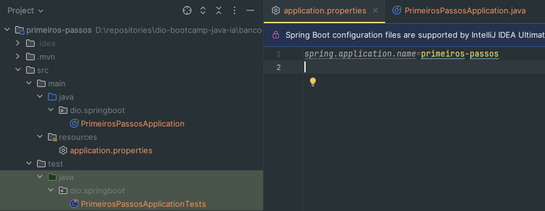
Por fim teremos um arquivo de propriedades `application.properties` que vai armazenar toda  configuração da nossa aplicaçao,  como portas de servidor, connection  string para banco de dados etc.

### Bean e CommandLineRunner

Diferente da maneira convecional que  utilizamos no projeto Java, não mais devemos utilizar o `new` para inicialização de objetos, pois em um contexto de inversão de controle e injeção de dependências, estas operações não são mais utilizadas.

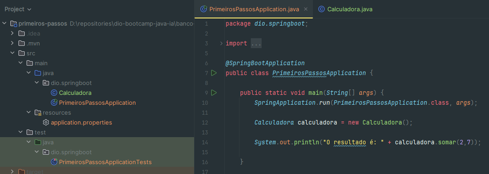
Aqui temos a forma  errada de utilizar o Spring Boot, pois como vimos anteriormente, não mais devemos utilizar o `new` para inicializar objetos.

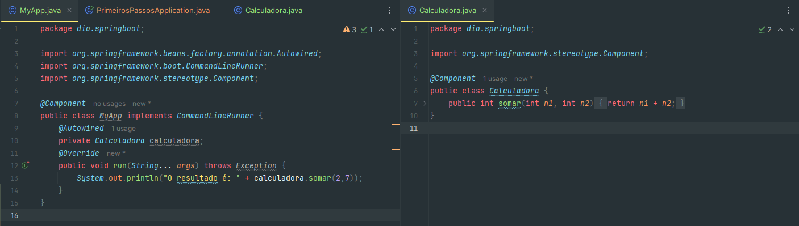
Ao invés de colocarmos nossa iteração junto da  inicialização do Spring Boot, vamos criar uma classe `MyApp` que funcionará como  nossa classe main.
Esta classe vai precisar implementar a  interface funcional `CommandLineRunner` que vai  implementar o  método `run()` como seu método principal.
Portanto agora diremos que a classe `MyApp` é um `@Component` e nossa `Calculadora` também é um `@Component` podendo assim ser chamada pela nossa inicialização `MyApp` em `private Calculadora calculadora;`.
Por fim através da notação `@Autowired` é onde realizamos a injeção de dependências, onde o Spring Boot entende que meu componente `MyApp` depende do componente `Calculadora` e assim podemos executar nossa aplicação obtendo o resultado da operação de soma.