# Fundamentos da Programação Orientada a Objetos

Vamos abordar os conceitos do paradigma e os pilares da orientação a objetos, classes, enums, construtores, Java Bens e UML.

## Conceito de POO

À medida que a tecnologia avança, as linguagens de programação também, é natural que tenhamos um nível maior de abstração quando se tratando de linguagens de alto e baixo nível.

**Baixo nível**: São linguagens que estão mais próxima da interpretação da máquina diante do algoritmo desenvolvido. Exemplo: **Assembly e C**.

**Alto Nível**: São linguagens que disponibilizam uma proposta de sintaxe maix próxima de interpretação humana. Exemplo: **Java, JavaScript, Python e C++**.

POO é um paradigma de programação baseado no conceito de "objetos", que podem conter dados na forma de campos, também conhecidos como atributos, e códigos, na forma de procedimentos, também conhecidos como métodos.

O que precisamos entender, é que cada vez mais as linguagens se adequam ao cenário real, proporcionando assim que o programador desenvolva algoritmos mais próximos de fluxos comportamentais, logo tudo ao nosso redor é representado como Objeto.

## Classes

Toda estrutura de código na linguagem Java é distribuído em arquivos com extensão **.java** denominados de **classe**.

As classes existentes em nosso projeto serão composta por:

**Identificador, Características e Comportamentos.**

* **Classe** *(class)*: A estrutura e ou representação que direciona a criação dos objetos de mesmo tipo.

* **Identificador** *(identity)*: Propósito existencial aos objetos que serão criados.

* **Características** *(states)*: Também conhecido como **atributos** ou **propriedades**, é toda informação que representa o estado do objeto.

* **Comportamentos** *(behavior)*: Também conhecido como **ações** ou **métodos**, é toda parte comportamental que um objeto dispõe.

* **Instanciar** *(new)*: É o ato de criar um objeto a partir de uma estrutura definida em uma classe.

Vamos ilustrar uma classe que abstrai um estudante que possui algumas características e ações.


Na imagem acima temos uma abstração de um estudante que possui suas características(atributos), name, age, color e sex. Também possui ações(métodos), eating, drinking e running. Tal código define o molde para nosso objeto que será instanciado.


Acima temos um exemplo em que a classe `Student` serve de molde para o objeto e assim o instanciamos com o `new Student()`. Após instanciado é possível definir suas características e utilizar seus métodos.

Seguindo algumas convenções, as nossas classes são classificadas como:

* **Classe de modelo (model)**: classes que representem estrutura de domínio de aplicação, exemplo: Cliente, Pedido, Nota Fiscal e etc.
* **Classe de serviço (service)**: classes que contém regras de negócio e validação de nosso sistema.
* **Classe de repositório (repository)**: classes que contém uma integração com banco de dados.
* **Classe de controle (controller)**: classes que possuem a finalidade de disponibilizar alguma comunicação externa à nossa aplicação, tipo http web ou webservices.
* **Classe utilitária (util)**: classe que contém recursos comuns à toda nossa aplicação.

## Pacotes

A linguagem Java é composta por milhares de classes com as finalidades de, por exemplo: Classes de tipos de dados, representação de texto, números, datas, arquivos e deiretórios, conexão a banco de dados, entre outras. 
Para melhorar a organização de classes da linguagem, esta possui recursos que organizam essas classes em pacotes (package). Os pacotes são subdiretórios a partir da pasta src do nosso projeto onde estão localizadas as classes da linguagem e novas que forem criadas para o projeto. Existem algumas convenções para a criação de pacotes já utilizados no mercado.

### Nomeclatura

Vamos imaginar que sua empresa se chama **Power Soft** e ela está desenvolvendo softwares comeciais, gorvernamentais e um software livre ou até código aberto. Abaixo teríamos os pacotes sugeridos conforme tabela abaixo:

* **Comercial**: com.powersoft
* **Governamental**: gov.powersoft
* **Código aberto**: org.powersoft

Acima já podemos perceber que existe uma definição para o uso do nome dos pacotes, porém podemos organizar ainda mais um pouco as nossas classes mediante a proposta de sua existência:

* **model**: Classes que representam a camada e modelo da aplicação: Cliente, Pedido, NotaFiscal, Usuario
* **repository**: Classes ou interfaces que possuem a finalidade de interagir com tabelas no banco de dados: ClienteRepository
* **service**: Classes que contém regras de negósio do sistema: ClienteService possui o método validar o CPF do cliente cadastrado
* **controller**: Classes que possuem a finalidade de disponibilizar os nossos recursos da aplicação para outras aplicações via padrão HTTP
* **view**: Classes que possuem alguma interação com a interface gráfica acessada pelo usuário
* **util**: Pacote que contém classes utilitárias do sistema: FormatadorNumeroUtil, ValidadorUtil

#### Identificação

Uma das características de uma classe é a sua identificação, Cliente, NotaFiscal, TituloPagar, porém quando esta classe é organizada por pacotes, ela passa a ter duas identificações. O nome simples (**próprio nome**) e agora o nome qualificado (**endereçamento do pacote + nome), exemplo: Considere a classe Usuario que está endereçada no pacote `com.controle.acesso.model`, o nome qualificado desta classe é **`com.controle.acesso.model.Usuario`**

### Package versus Import

A localização de uma classe é definida pela palavra reservada package, logo, uma classe só contém uma definição de package no arquivo, sempre na primeira linha do código. Para a utilização de uma classe existentes em outros pacotes, necessitamos realizar a importação das mesmas, seguindo a recomendação abaixo:

    package

    import ...
    import ...

    public class MinhaClasse {

    }

#### Por que é tão importante compreender de pacotes?

A linguagem Java é composta por milhares de classes internas, classes desenvolvidas em projetos disponíveis através de bibliotecas e as classes do nosso projeto. Logo, existe uma enorme possibilidade da existência de classes de mesmo nome.

É nesta hora, que nós desenvolvedores precisamos detectar qual classe iremos importar em nosso projeto.

Um exemplo clássico é a existência de classes **`java.sql.Date`** e **`java.util.Date`** da própria linguagem.

## Visibilidade de recursos

### Modificadores

Em Java, utilizamos três palavras reservadas e um conceito default (sem nenhuma palavra reservada) para definir os quatro tipos de visibilidade de atributos, métodos e até mesmo classes no que se refere ao acesso por outras classes. Iremos ilustrar do mais visível ao mais restrito tipo de visibilidade nos arquivos em nosso projeto.

Para uma melhor ilustração, iremos representar os conceitos de visibilidade de recursos através do contexto em uma lanchonete que vende lanche natural e suco.

#### Modificador public

Como o próprio nome representa, quando nossa classe, método ou atributo é definido como public, qualquer outra classe em qualquer outro pacote pode visualizar tais recursos.


No projeto acima, abstraimos uma lanchonete. Temos as classes `Cozinheiro`, `Atendente`, `Almoxarife` e `Cliente`. Todas elas possuem métodos, porém esses métodos estão todos públicos.
O que devemos entender é que nem tudo no projeto precisa estár público.
De maneira ilustrativa, neste projeto o cliente pode ver o que está acontecendo na cozinha e no almoxarife, mas isso não é interessante.


Acima temos a classe principal do nosso projeto, onde as ações são executadas.
Observe nos comentários as sugestões para mudança de visibilidade nos métodos.
Vamos a seguir refatorar este projeto para que se adeque a essas regras.

#### Modificador default

O modificador **`default`** está fortemente associado a organização das classes por pacotes, algumas implementações não precisam estar disponíveis por todo o projeto, e este modificador de acesso restringe a visibilidade por pacotes.

Dentro do pacote **`lanchonete`**, iremos criar dois sub-pacotes para representar essa divisão do estabelecimento.

* **lanchonete.atendimento.cozinha**: Pacote que contém classes da parte cozinha da lanchonete e atendimentos.
* **lanchonete.area.cliente**: Pacote que contém classes relacionadas ao espaço do cliente.


Nosso projeto agora tem a divisão de pacotes descrita anteriormente e agora a abstração faz mais sentido, pois separamos o cliente da cozinha, pois não faz sentido que o cliente possa visualizar essas áreas da nossa lanchonete.


Ao modificarmos os métodos `entregarIngredientes` e `trocarGas` na classe `Almoxarife` para **`default`** (que no caso é um modificador implícito e não precisa de palavra reservada), ela fica inacessível a classe `Estabelecimento`, mas a classe `Cozinheiro` pode acessa-la pois está dentro do mesmo pacote.


Quando definimos o método `trocarGas` na classe `Atendente` como **`default`**, a classe `Cozinheiro` não está mais autorizada a pedir para o `Atendente` `trocarGas`. Como numa definição hierarquica de um restaurante. Portanto devemos retirar esse método da classe `Cozinheiro` e `Estabelecimento`.

#### Modificador private

Depois de reestruturar nosso estabelecimento (projeto), onde, temos as divisões (pacotes) espaço do cliente e atendimento, chegou a hora de uma reflexão sobre visibilidade ou modificadores de acesso.

Conhecemos as ações disponíveis nas classes `Cozinheiro`, `Almoxarife`, `Atendente` e `Cliente`, mesmo com a organização da visibilidade por pacote, será se realmente estas classes precisam ser tão explicitas?

* Será se o `Cozinheiro` precisa saber que/como o `Almoxarife` controla as entradas e saídas?
* Que o `Cliente` precisa saber como o `Atendente` recebe o pedido para servir sua mesa?
* Que o `Atendente` precisa saber que antes de pagar o `Cliente` consulta o saldo do App?

Diante destes questionamentos é que nossas classes precisam continuar mantendo suas ações (métodos) mas nem todas precisam ser vistas por ninguém.


Com isso em mente modificamos os métodos `prepararVitamina`, `prepararLanche`, `selecionarIngredientesVitamina`, `baterVitaminaLiquidificador` e `lavarIngredientes` pois não interessa ao estabelecimento como o cozinheiro realiza essas ações, portanto serão ações privadas visíveis somente pelo próprio cozinheiro.


Definimos nas classes `Almoxarife` e `Atendente` que os métodos `controlarSaida`, `controlarEntrada`, `pegarPedidoBalcao` e `pegarLancheCozinha` são privados, mas note que tais métodos são chamados por métodos públicos da classe. Como é o caso de `controlarSaida` que é chamado pelo método `entregarIngredientes`, pois não interessa a quem chama este método como o almoxarife controla a saída de ingredientes.


Por fim retiramos da classe `Cliente` o método `pegarPedidoBalcao`, pois definimos que esta ação é responsabilidade somente do `Atendente` e o método `consultarSaldoAplicativo` passa a ser privado pois se trata de uma ação sigilosa que outras classes não podem ter acesso.

#### Modificador protected

Este modificador funciona de forma parecida ao modificador `private`, mas no modificador `private` as classes filhas não podem utilizar estes métodos, é aí que vem o modificador `protected`.


Nesta classe possuimos dois métodos `protected` que podem ser utilizados por suas classes filhas, mas estão protegidos do uso em outras partes do projeto, portanto nenhuma outra classe que não seja filha desta classe abstrada ou que não pertença ao mesmo pacote poderá utilizar estes métodos.

## Getter e Setter

Seguindo a convensão Java Beans

Os métodos "Getters" e "Setters" são utilizados para buscar valores atributos ou definir novos valores de atributos de instâncias de classes.

O método **Getter** retorna o valor do atributo especificado.

O método **Setter** define outro novo valor para o atributo especificado.

Vemos o código abaixo da criação de um objeto Aluno com nome e idade:


Seguindo a convenção Java Beans, uma classe que contém esta estrutura de estados deverá seguir as seguintes regras:

* Os atributos precisam ter o modificador de acesso `private`. Ex.: `private String nome;`
* Como agora os atributos estarão somente a nível de classe, precisaremos dos métodos **get**X e **set**X, Ex.: `getNome()` e `setNome(String novoNome)`
* O método **get** é responsável por obter o valor atual do atributo, logo ele precisa ser `public` retornar um tipo correspondente ao valor, es.: `public String getNome() {};`
* O método **set** é responsável por definir ou modificar o valor de um atributo em um objeto, logo ele também precisa ser `public`, receber um parâmetro do mesmo tipo da variável mas não retorna nenhum valor void. Ex.: `public void setNome(String newNome) {} ;`


Agora nossa classe `Aluno` segue a convenção Java Beans.


Seguindo a mesma convenção, a classe `Escola` não mais atribui os valores diretamente ao objeto, mas sim o próprio objeto dispoe de métodos para realização destas operações.

Tal convenção foi criada para melhorar a segurança de nossas aplicações e também facilitar a realização de validações no momento de atribuir valores, onde com o atributo sendo público esta validação deveria ser feita fora da classe.

## Construtores

Sabemos que para criar um objeto na linguagem Java utilizamos a seguinte estrutura de código:

    Classe novoObjeto = new Classe();

Desta forma será criado um novo objeto na memória, este recurso também é conhecido como instanciar um novo objeto.

Muitas das vezes queremos que já na instanciação de um objeto, a linguagem já solicite para quem for criar este novo objeto defina algumas propriedades essenciais. Abaixo iremos ilustrar uma classe Pessoa onde a mesma terá os atributos, Nome, CPF, Endereço.


Criaremos uma Pessoa mas como não temos um setter para nome e cpf, este objeto não tem como receber estes valores.


Ao executar este código, sua saída será nula pois não temos o CPF e nome definidos.


Agora temos na classe `Pessoa` um construtor, que deverá sempre ter o nome idêntico ao da classe e seus argumentos que serão atribuidos às propriedades.


Por fim no momento de sua instanciação, devemos passar os argumentos solicitados pelo nosso construtor. Assim este código passará a imprimir os valores de suas propriedades que agora não são mais nulas.

## Enums

Enum é um tipo especial de classe onde os objetos são previamente criados, imutáveis e disponíveis por toda aplicação.

Usamos Enum quando o nosso modelo de negócio contém objetos de mesmo contexto que já existem de forma pré-estabelecida com a certeza de não haver tanta alteração de valores.

**Exemplos:**
* **Grau de Escolaridade**: Analfabeto, Fundamental, Médio, Superior
* **Estado Civil**: Solteiro, Casado, Divorciado, Viúvo
* **Estados Brasileiros**: São Paulo, Rio de Janeiro, Piauí, Maranhão

Enquanto que uma constante é uma variável de tipo com valor imutável, um enum é um conjunto de objetos pre-definidos na aplicação.

Como um enum é um conjunto de objetos, logo, estes objetos podem conter atributos e métodos. Veja o exemplo de um enum para disponibilizar os quartro estados brasileiros citados acima, contendo informações de: Nome, Sigla e um método que pega o nome de cada estado e já retorna com tudo minúsculo.


Podemos observar que a classe não mais se chama `class`, mas sim `enum` e seguindo a convenção Java Beans seus atributos também são privados, podemos notar também que seu construtor é privado, pois um enum jamais é contruido de fora, portanto definimos que este enum tem uma sigla e um nome.
Logo abaixo da declaração deste enum já temos as definições dos objetos que serão construídos a partir deste enum.


Após definirmos os valores do enum, em uma classe main podemos então utilizar um for para percorrer os valores deste enum e imprimi-los no console.


Também podemos armazenar numa variável do tipo `EstadoBrasileiro` um dos valores contidos neste enum. É como se dessemos vários "new" e cada um deles armazena um objeto que pode ser chamado individualmente.

_**Enum servem para valores que não sofrem alteração constante, portanto atente-se para o seu uso.**_

## UML

Linguagem de Modelagem Unificada ou UML é uma notação que possibilita a representação gráfica do projeto.

Na UML temos três conceitos necessários para compreendermos inicialmente:

**diagramas**, **elementos** e **relacionamentos**. 

As notações UML são distribuídas em duas categorias de diagramas, a estrutural e a comportamental conforme listagem abaixo:

### Diagramas estruturais

* **Diagrama de classe**: O diagrama de Classes é utilizado para fazer a representação de estruturas de classes de negócio, interfaces e outros componentes do sistema. Por esta característica, este diagrama é considerado o mais importante para a UML, pois auxilia a maioria dos demais diagramas.
* **Diagrama de objetos**: Este diagrama representa os objetos existentes em um determinado instante ou fato na aplicação. Assim conseguimos ter uma perspectiva do estado de nossos objetos mediante a interação dos usuários no sistema.

#### Diagrama de classe
O diagrama de classes ilustra **graficamente** como classes serão estruturadas e interligadas entre si diante da proposta do nosso software.

Em diagrama a estrutura das classes é constituída por:

**Identificação**: Nome e/ou finalidade da classe
**Atributos**: Propriedades e/ou características
**Operações**: Ações e/ou métodos

##### Relacionamentos

Em um diagrama as classes podem existir de forma independete, mas obviamente haverá em alguma etapa da aplicação a necessidade de algumas se relacionarem, o que devemos compreender é o nível de dependência entre elas:

###### Associação

Uma associação define um relacionamento entre duas classes, permitindo que um objeto tenha acesso a estrutura de um outro objeto.

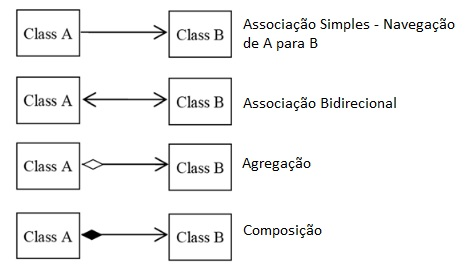

* **Agregação**: Em uma agregação a classe principal contém uma relação com outra classe mas ela pode existir sem a classe agregadora. Imagina em um cadastro de Candidatos, podemos encontrar candidatos que ainda não possuam uma Profissão.

*Candidato é a classe principal e a Profissão agregação*
* **Composição**: A composição já caracteriza uma dependência existencial entre a classe principal e a classe associada. Imaginamos que uma Admissão só poderá existir contendo suas informações básicas e a composição do Candidato selecionado.

*Admissão é a classe principal e Candidato compõe a Admissão*

###### Multiplicidade

Nem sempre o relacionamento entre classe será de **um para um**, um determinado cenário poderá exigir multiplicidades especídifcas conforme opções abaixo:

* 1.-> Representa uma associação **contendo um elemento**.
* *.-> Representa uma associação **contendo uma lista de elementos**.
* 0..1-> Representa uma associação **contendo zero ou um elemento**.
* 0..*-> Representa uma associação **contendo zero ou uma lista de elementos**.
* 1..*-> Representa uma associação **contendo um ou uma lista de elementos**.

###### Visibilidade

Os atributos e métodos de uma classe podem receber níves de visibilidade, e na UML existem símbolos que representam cada um deles.

* (+) Visibilidade pública
* (#) Visibilidade protegida (muito associada a herança)
* (-) Visibilidade privada

###### Representação


---

# Pilares da POO

**Programação orientada a objetos** (**POO**, ou **OOP** segundo as suas siglas em inglês) é um paradigma de programação baseado no conceito de "objetos", que podem conter dados na forma de campos, tambpem conhecidos como métodos.

Como se trata de um conexto análogo ao mundo real, tudo no qual nos referimos são objetos. Exemplo: Conta Bancária, Aluno, Veículo, Transferência etc.

A programação orientada a objetos é bem requisitada no contexto das aplicações mais atuais no mercado devido a possibilidade de reutilização de código e a capacidade de representação do sistema ser muito mais próximo do mundo real.

Para uma linguagem ser considerada orientada a objetos, este deve seguir o que denominamos como **Os quatro pilares da orientação a objetos**:

* **Encapsulamento**: Nem tudo precisa estar visível, grande parte do nosso algoritmo pode ser distribuído em métodos com finalidades específicas que complementa uma ação em nossa aplicação.
Exemplo: Ligar um veículo exige muitas etapas para a engenharia, mas o condutor só visualiza a ignição, dar a partida e a "magia" acontece.

* **Herança**: Características e comportamentos comuns podem ser elevados e compartilhados através de uma hierarquia de objetos.
Exemplo: Um Carro e uma Motocicleta possuem propriedades como chassi, ano de fabricação e métodos como acelerar, frear. Logo para não ser um processo de codificação redundante, podemos desfrutar da herança criando uma classe **Veiculo** para que seja herdada por Carro e Motocicleta.

* **Abstração**: É a indisponibilidade para determinar a lógica de um ou vários comportamentos em um objeto.
Exemplo: **Veículo** determina duas ações como acelerar e frar, logo estes comportamentos deverão ser asbtratos pois existem mais de uma maneira de se realizar a mesma operação. Ver *Polimorfismo*.

* **Polimorfismo**: São as inúmeras maneiras de se ralizar uma mesma ação.
Exemplo: Veículo determina duas ações como acelerar e frar, primeiramente precisamos identificar se estaremos nos referindo a **Carro** ou **Motocicleta** para determinar a lógica de aceleração e frenagem dos respectivos veículos.

Para ilustrar a proposta dos Princípios de POO no nosso quotidiano, vamos simular algumas funcionalidades dos aplicativos de mensagens instantâneas pela internet.

Vamos descrever em UML e depois em código algumas das principais funcionalidade de qualquer serviço de comunicação instantânea pela internet, inicialmente pelo MSN Messenger e depois inserindo os demais, considerando os princípios de POO.


**Pontos de atenção**
* Todos os métodos da classe são **public** (tudo realmente precisa estar visível?)
* Só existe uma única forma de se comunicar via internet (como ter novas formas de se comunicar mantendo a proposta central?)

## Encapsulamento
*Nem tudo precisa estar disponível para todos*

Já imaginou você instalar o MSN Messenger e ao querer enviar uma mensagem, te fosse solicitado verificar se o computador está conectado a internet e depoism pedir para você salvar a mensagem no histórico? Ou, se ao tentar enviar um SMS pelo celular, primeiro você precisasse consultar manualmente o seu saldo?

Acredito que não seria uma experiência tão agradáveç de ser executada recorrentemente por nós usuários.

Mesmo ainda sendo necessária algumas etapas nos processos citados, não é um requisito uma visibilidade pública, isso quer dizer que, além da própria classe que possui a responsabilidade de uma determinada ação.

Quanto ao MSN Messenger, para nós, só é relevante saber que podemos e como devemos enviar e receber a mensagem, logo, as demais funcionalidades poderão ser consideradas privadas (private). E é aí que se caracteriza a necessidade do pilar Encapsulamento, o que esconder?

Vejamos a refatoração abaixo da nossa classe MSN Messenger


Definindo os métodos `validarConectadoInternet` e `salvarHistoricoMensagem` como privado, essas não estão mais disponíveis para o usuário, portanto chamamos esses métodos nas funções `enviarMensagem` e `receberMensagem` para que essas verificações ocorram de maneira automática e escondendo o funcionamento dessas funções por meio do encapsulamento.

## Herança
*Nem tudo se copia, as vezes se herda*

Já imaginou você ter sido classificado para a vaga de emprego de seus sonhos e como desafio, justamente você criar um diagrama de classes e em seguida os respectivos arquivos .java que apresentasse os fundamentos de POO com base no contexto de vários aplicativos de mensagens instantâneas?


Para dar os primeiros passos nesse processo seletivo, você poderia simplesmente copiar as 3 classes e colar em seus respectivos projetos.

Agora é escrever o código das classes acima e esperar pela contratação.

Mas infelizmente essa não é a melhor alternativa para resolver este problema.

Além de uma compreensão do desafio, é necessário, que tenhamos domínio dos pilares de POO e aplicá-los em situações iguais a esta.

**Note**: Todas as três classes possuem a mesma estrutura comportamental, e diste deste contexto se encaixa perfeitamente o segundo pilar da POO, a Herança.


Diante deste diagrama de herança teremos agora uma estrutura de projeto onde cada aplicativo de mensagem herda as características da classe `ServicoMensagemInstantanea`, promovendo o reaproveitamento do código sem precisar reescreve-lo.

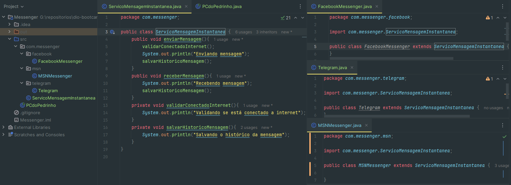
Note que as três classes de aplicativos de mensagem utilizam a palavra reservada `extends` para apontar para classe pai e assim herdar o nosso código que antes estava dentro da própria classe do aplicativo.

## Abstração
*Para você ser é preciso você fazer*

Sabemos que qualquer sistema de mensagens instantâneas se realiza as mesmas operações de Enviar e Receber Mensagem, dentre outras operações comund ou exclusivas de cada aplicativo disponível no mercado.

Mas será se as ações realizadas contém o mesmo comportamento? Acreditamos que não.

O que vale destacar para compreender aqui é que todo e qualquer sistema de mensagem precisa sim no mínimo Enviar e Receber Mensagem, logo, consideramos se firmar um "contrato" para qualquer um que queira se apresentar assim para o mercado.

Observem a nova estruturação dos códigos abaixo com base na implementação apresentada no pilar Herança.


Vamos definir a classe `ServicoMensagemInstantanea` como uma classe asbtrata e os dois métodos `private` da classe passam a ser `protected` para que seja possível a sua utilização em suas classes filha.
_**Note que os métodos abstratos não possuem corpo.**_


Agora que definimos a classe pai como abstrata, será obrigatória a implementação da lógica em cada uma de suas classes filhas, pois cada aplicativo que herda desta classe abstrata tem uma maneira diferente de fazer a mesma coisa.

## Polimorfismo
*Um mesmo comportamento de várias maneiras*

Podemos observar no contexto de *Abstração* e *Herança* que conseguimos criar uma singularidade estrutural de nossos elementos. Isso quer dizer que qualquer classe que deseja representar um serviço de mensagens, basta estender a classe `ServicoMensagemInstantanea` e implementar os respectivos métodos *abstratos*. O que vale reforçar aqui é, cada classe terá a mesma ação executando procedimentos de maneira especializada.


Implementando o polimorfismo em nosso projeto:

Podemos definir condicionais para que as classes especializadas sejam instanciadas a partir da escolha do usuário, mas todas elas possuem o método `enviarMensagem()` e `receberMensagem()` pois se tratam de uma classe especializada de uma classe abstrata.

## Interface

Como vimos anteriormente **Herança** é um dos pilares de POO, mas uma coriosidade que se deve ser esclarecida na linguagem Java é que a mesma não permite o que conhecemos como **Herança Múltipla**.

Á medida que vão surgindo novas necessidades, novos equipamentos (objetos) nascem para atender as expectativas de oferecer ferramentas com finalidades bem específicas como por exemplo: Impressoras, Digitalizadoras, Copiadoras e etc.

Observem que não há uma especificação de marca, modelo e ou capacidade de execução das classes citadas acima, isto é o que consideramos o nível mais abstrato de orientação a objetos que denominamos como **interfaces**.

Um dos maiores questionamentos dos desenvolvedores é se **interfaces** são o mesmo que **classes**, ou um molde para representação dos objetos reais.

Como citado acima Java não permite herança múltipla, logo, vamos imaginar que recebemos o desafio de projetar uma nova classe para criar objetos que representem as três características citadas acima e que iremos denominar de **EquipamentoMultifuncional**.

Para uma melhor compreensão, vamos analisar os diagramas de classes abaixo, comparando o conceito de herança entre classes e interfaces.

**Cenário 1**


Exemplo de aplicação de Herança entre classes abstratas.

**Cenário 2**


Ilustração do uso de interfaces para aplicar Herança Múltipla.


**Implementando Interfaces**

Precisamos compreender que métodos de interface já são implicitamente **`public abstract`**, portanto é obrigatória a sua implementação entre outras classes.


Ao invés da palavra reservada `extends` para definir uma herança, agora a classe utiliza `implements`, pois cada classe implementa a interface e seu próprio algoritmo.


A interface possibilita que uma única classe implemente várias interfaces, possibilitando que a classe `EquipamentoMultifuncional`, implemente as classes `Copiadora, Digitalizadora, Impressora` e faça as três funções definidas nas interfaces.


Seguindo a lógica de herança das interfaces, podemos notar que um `EquipamentoMultifuncional`, pode ser atribuido a `Impressora, Digitalizadora, Copiadora` pois tal equipamento faz as três funções.


Mas se instanciarmos um `Scanner` logo observamos que não pode haver atribuição com `Impressora, Copiadora`, pois tal interface não implementa esta classe, pois apenas a `Digitalizadora` implementa uma interface `Scanner`.


---

# Conhecendo Collections Java

As Collections em Java são um modo de trabalhar com conjuntos de dados de forma parecida com um array. No fundo as Collections trabalham com array, mas o Collection Framework é utilizado para trabalhar apenas com Objetos.

## Collection Framework API

- Uma coleção (collection) é uma estrutura de dados que serve para agrupar muitos elementos em uma única unidade; estes elementos precisam ser objetos.
- Uma Collection pode ter coleções homogêneas e heterogêneas, normalmente utilizamos coleções homogêneas de um tipo específico.
- O núcleo principal das coleções é formado pelas interfaces da figura abaixo; essas interfaces permitem manipular a coleção independentemente do nível de detalhe que elas representam.
- Temos quatro grandes tipos de coleções: List (lista), Set (conjunto), Queue (fila) e Map (mapa). A partir dessas interfaces, temos muitas subclasses concretas que implementam várias formas diferentes de se trabalhar com cada coleção.

<p align="center">
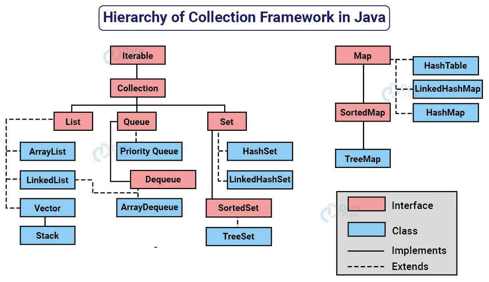<br>
<a href="https://data-flair.training/blogs/collection-framework-in-java/">Hierarchy of Collection Framework in Java </a>
</p>

- Todas as interfaces e classes são encontradas dentro do pacote (package) `java.util`.
- Embora a interface `Map` não seja filha direta da interface `Collection`, ela também é considerada uma coleção devido à sua função.

<p align="center">
<br>
<a href="https://docs.oracle.com/en/java/javase/17/docs/api/java.base/java/util/Collection.html">Method Sumary Collection Interface</a>
</p>


## Generics Type

- Um tipo genérico é uma classe genérica ou uma interface que é parametrizada em relação a tipos. 
- A classe `Box` a seguir será modificada para demonstrar o conceito:

```java
public class Box {
    private Object object;

    public void set(Object object) { this.object = object; }
    public Object get() { return object; }
}
```

-  O símbolo `<>` é chamado de "diamond" ou "diamond operator" foi um recurso introduzido no Java 7 e é usado no contexto de tipos genéricos em Java para inferir automaticamente o tipo com base no contexto.
- Para atualizar a classe `Box` para usar generics, você cria uma declaração de tipo genérico alterando o código `public class Box` para `public class Box<T>`.
- Isso introduz a variável de tipo, `T`, que pode ser usada em qualquer lugar dentro da classe:

```java
/**
Versão genérica da classe Box.
@param <T> o tipo do valor sendo armazenado
*/
public class Box<T> {
	// T representa "Type" (tipo)
    private T t;

    public void set(T t) { this.t = t; }
    public T get() { return t; }
}
```

- Como você pode ver, todas as ocorrências de Object são substituídas por T. 
- Uma variável de tipo pode ser qualquer tipo não primitivo que você especificar: qualquer tipo de classe, qualquer tipo de interface, qualquer tipo de array ou até mesmo outra variável de tipo.
- Essa mesma técnica pode ser aplicada para criar interfaces genérica.
- Os nomes de parâmetros de tipo mais comumente usados são:
	- E - Elemento (usado extensivamente pelo Java Collections Framework)
    - K - Chave
    - N - Número
    - T - Tipo
    - V - Valor
    - S, U, V, etc. - 2º, 3º, 4º tipos

### Vantagens simples de usar generics nas interfaces Collection em Java:

1. Segurança do tipo de dados: O uso de generics garante que apenas objetos de um tipo específico possam ser adicionados à coleção, evitando erros de tipo e garantindo que você esteja lidando com os dados corretos.
2. Código mais legível: Ao usar generics, você pode especificar o tipo de dados esperado ou retornado pela coleção, o que torna o código mais fácil de entender e ler.
3. Detecta erros mais cedo: O compilador verifica se você está usando os tipos corretos durante a compilação, ajudando a identificar erros de tipo antes mesmo de executar o programa.
4. Reutilização de código: Com generics, você pode criar classes e métodos genéricos que funcionam com diferentes tipos de coleções, evitando a necessidade de duplicar código para cada tipo específico.
5. Melhor desempenho: O uso de generics pode melhorar o desempenho, pois evita a necessidade de conversões de tipo desnecessárias e permite que o compilador otimize o código com base no tipo especificado.

## Comparable X Comparator

### Comparable

- `Comparable` fornece uma única sequência de ordenação. Em outras palavras, podemos ordenar a coleção com base em um único elemento, como id, nome e preço.
- `Comparable` afeta a classe original, ou seja, a classe atual é modificada.
- `Comparable` fornece o método `compareTo()` para ordenar elementos.
- `Comparable` está presente no pacote `java.lang`.
- Podemos ordenar os elementos da lista do tipo `Comparable` usando o método `Collections.sort(List)`.

### Comparator

- O `Comparator` fornece o método `compare()` para ordenar elementos.
- O `Comparator` fornece múltiplas sequências de ordenação. Em outras palavras, podemos ordenar a coleção com base em múltiplos elementos, como id, nome, preço, etc.
- O `Comparator` não afeta a classe original, ou seja, a classe atual não é modificada.
- Um `Comparator` está presente no pacote `java.util`.
- Podemos ordenar os elementos da lista do tipo `Comparator` usando o método `Collections.sort(List, Comparator)`.

### Collections

- A classe `Collections` é uma classe utilitária do Java para operações comuns em coleções.
- Ela fornece métodos para ordenação, busca, manipulação e sincronização de coleções.
- O método `sort()` é usado para ordenar uma lista em ordem ascendente.
- O método `sort()` em conjunto com `Collections.reverseOrder()` permite ordenar em ordem descendente.


```java
package main.java.comparableXcomparator;

import java.util.Comparator;

// Uma classe 'Livro' que implementa Comparable
class Livro implements Comparable<Livro> {
	private String titulo;
	private String autor;
	private int ano;

	// Construtor
	public Livro(String ti, String au, int an) {
		this.titulo = ti;
		this.autor = au;
		this.ano = an;
	}

	// Usado para ordenar livros por ano
	public int compareTo(Livro l) {
		return titulo.compareTo(l.titulo);
	}

	// Métodos getters para acessar os dados privados
	public String getTitulo() {
		return titulo;
	}

	public String getAutor() {
		return autor;
	}

	public int getAno() {
		return ano;
	}
}

// Classe para comparar Livro por autor
class CompararAutor implements Comparator<Livro> {
  @Override
  public int compare(Livro l1, Livro l2) {
		return l1.getAutor().compareTo(l2.getAutor());
	}
}

// Classe para comparar Livro por ano
class CompararAno implements Comparator<Livro> {
  @Override
  public int compare(Livro l1, Livro l2) {
		if (l1.getAno() < l2.getAno())
			return -1;
		if (l1.getAno() > l2.getAno())
			return 1;
		else
			return 0;
	}
}

class CompararAnoAutorTitulo implements Comparator<Livro> {
	@Override
	public int compare(Livro l1, Livro l2) {
		int ano = Integer.compare(l1.getAno(), l2.getAno());
		if (ano != 0)
			return ano;
		int autor = l1.getAutor().compareTo(l2.getAutor());
		if (autor != 0)
			return autor;
		return l1.getTitulo().compareTo(l2.getTitulo());
	}
}
```

## List

<p align="center">
<br>
<a href="https://data-flair.training/blogs/collection-framework-in-java/">Hierarchy of Collection Framework in Java </a>
</p>

- A interface <code>List</code> é uma coleção ordenada que permite a inclusão de elementos duplicados.
- É um dos tipos de coleção mais utilizados em Java, e as classes de implementação comuns são <code>ArrayList</code> e <code>LinkedList</code>.
- A <code>List</code> se assemelha a uma matriz com comprimento dinâmico, permitindo adicionar ou remover elementos.
- A interface <code>List</code> fornece métodos úteis para adicionar elementos em posições específicas, remover ou substituir elementos com base no índice e obter sublistas usando índices.
- A classe <code>Collections</code> fornece algoritmos úteis para manipulação de <code>List</code>, como ordenação (sort), embaralhamento (shuffle), reversão (reverse) e busca binária (binarySearch).

> ##### *ArrayList*: O ArrayList é uma implementação da interface List que armazena os elementos em uma estrutura de array redimensionável. Isso significa que ele pode crescer automaticamente à medida que novos elementos são adicionados. A principal vantagem do ArrayList é o acesso rápido aos elementos por meio de índices, o que permite recuperar um elemento específico de forma eficiente. No entanto, adicionar ou remover elementos no meio da lista pode ser mais lento, pois requer a realocação de elementos.

> ##### *LinkedList*: O LinkedList é uma implementação da interface List que armazena os elementos em uma lista duplamente vinculada. Cada elemento contém referências para o elemento anterior e próximo na lista. A principal vantagem do LinkedList é a eficiência na adição ou remoção de elementos no início ou no final da lista, pois não é necessário realocar elementos. No entanto, o acesso aos elementos por meio de índices é mais lento, pois requer percorrer a lista até o elemento desejado.

> ##### *Vector*: O Vector é uma implementação antiga da interface List que é semelhante ao ArrayList, mas é sincronizada, ou seja, é thread-safe. Isso significa que várias threads podem manipular um objeto Vector ao mesmo tempo sem causar problemas de concorrência. No entanto, essa sincronização adiciona uma sobrecarga de desempenho, tornando o Vector menos eficiente do que o ArrayList em cenários em que a concorrência não é um problema. Por esse motivo, o uso do Vector é menos comum em aplicações modernas.

### Operações Básicas com List

Para começarmos, vamos explorar as funções básicas de um ArrayList.

Primeiramente devemos instanciar esse ArrayList por meio de um construtor e uma variável privada seguindo a convenção Java Beans.


Observe que definimos a propriedade `listaTarefas` como uma `List<>` e no Diamond definimos que esta é uma lista de `Tarefa`.
O Construtor vai garantir que a lista de tarefas sempre instancie uma lista vazia em `new ArrayList<>()`


A classe `Tarefa` por sua vez possue a propriedade `descricao` e se inicializa com um construtor para que sempre tenha uma descrição. Também implementamos os métodos ``get/set``.

Para exemplificar as operações básicas com ArrayList estaremos utilizando a abstração de uma lista de tarefas.

#### Adicionando elementos à List

A operação mais básica de um ArrayList é a de adicionar elementos.


O ArrayList possui o método `.add()`, que neste caso vai pedir um objeto `Tarefa` que será instanciado e adicionado à lista.

#### Removendo elementos de uma List

Em nosso exemplo vamos remover um elemento pela sua descrição. Para fazer isso precisamos percorrer a lista procurando os elementos que correspondem à nossa descrição.


O ArrayList possui vários métodos para remover elementos de um array, para este exemplo vamos utilizar o método `.removeAll()` que recebe uma coleção de objetos, ou seja uma lista de objetos que deve coicidir com um determinado tipo.


Neste método vamos instanciar uma nova lista de tarefas `tarefasParaRemover` e vamos percorrer nossa `listaTarefas` comparando os valores da descrição fornecida para o método com o elemento `tarefa` percorrido no laço **forEach** utilizando os métodos `getDescricao().equalsIgnoreCase()`.
Caso a descrição fornecida seja igual, vamos adicionar este elemento à nossa lista `tarefasParaRemover` e passamos esta lista como parâmetro para o método `.removeAll()` que se encarregará de remover da nossa lista `listaTarefas` todos os elementos que estão presentes em nossa lista `tarefasParaRemover`.

#### Obtendo tamanho da List

Para obter o tamanho do ArrayList é muito simples.


Com um método que retorna inteiro apenas utilizamos o método `.size()` presente no ArrayList e tal método retornará o valor correspondente ao seu tamanho.

#### Obtendo elementos de uma List

Se implementarmos um método `obterDescricoesTarefas()` e este apenas implementar um `sout` com a `listaTarefas`.


Vamos obter o endereço de memória de cada elemento contido na lista e não é este o resultado que queremos.

Para obter a descrição do item precisamos sobrescrever o método `.toString()` na classe `Tarefa`.

1. Na IDE IntelliJ, pressione `Alt + Insert`
2. Vai abrir um menu generate
3. Navegue até `toString()`

4. Será aberta uma janela com as propriedades que serão geradas ao sobrescrever o método

5. Clique em `OK`


Agora temos o método `toString` que passa a retornar o objeto e suas propriedades

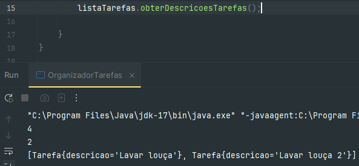
Ao chamar o método novamente podemos observar que foi impresso no console algo parecido com um arquivo JSON que está de acordo com o método que sobrescrevemos na classe `Tarefa`.

### Pesquisa

Para exemplificar a pesquisa em ArrayList vamos utilizar a abstração de um catálogo de livros.


Como no exemplo anterior, vamos definir um construtor para instanciar uma lista vazia e teremos um método `adicionarLivro` para inserir objetos nesta lista.

#### Pesquisa por propriedade em List

Podemos realizar uma pesquisa dentro de um ArrayList por meio de uma propriedade contida nos objetos presentes na lista.


Neste exemplo vamos definir primeiramente uma condicional para verificar se a lista está vazia em `!catalogoLivros.isEmpty()`.
Seguindo faremos um laço forEach e para cada propriedade `autor` correspondente ao argumento passado para o nosso método, adicionamos este elemento à uma nova lista.
Por fim retornamos uma lista com todos os livros escritos por tal autor.


A mesma lógica pode ser aplicada para uma pesquisa por título. Neste caso queremos apenas o primeiro valor que for encontrado dentro do ArrayList, então utilizamos um `break;` para interromper o laço e retornar o valor do livro que corresponde ao argumento passado para o método.

#### Pesquisa por intervalo em List

Podemos fazer uma pesquisa por intervalo de tempo utilizando o operador lógico **`E`**.


Como nos exemplos anteriores, utilizamos o laço forEach para percorrer a lista e para cada elemento que é maior ou igual ao `anoInicial` **`E`** menor ou igual ao `anoFinal` será adicionado à lista e o método retornará esta lista com os livros dentro deste intervalo.

### Ordenação

Para exemplificar a ordenação de um ArrayList vamos utilizar a abstração de um sistema de cadastro de pessoas.


Como nos exemplos anteriores, definimos o construtor para instanciar a lista e um método para adicionar pessoas.

#### Ordenando List com interface Comparable

Neste exemplo estaremos implementando um método para ordenar uma lista de pessoas por idade.
Para utilizar a interface Comparable primeiramente precisamos implementa-la em nossa classe Pessoa.


Implementando a classe `Comparable` devemos passar o Generic Type a ela, que neste caso é a nossa própria classe `<Pessoa>`. Então dessa forma implementamos o método `compareTo(Pessoa p)`, onde `p` representa o nosso objeto a ser comparado.
Utilizaremos também o Class wrapper `Integer` que possui o método `compare`, que por sí só já faz uma comparação entre dois números e identifica qual é o maior entre eles. Por fim este método recebe nossa propriedade `idade` e a compara com nosso objeto por meio do método `getIdade()`.


Em nosso método `ordenarPorIdade()` vamos instanciar uma nova lista que diferente de outros casos não vai receber um ArrayList vazio, mas sim nossa `listaPessoas` que até o momento não está ordenada.
Utilizando a classe `Collection` o método `.sort()` vai receber esta lista e como implementamos um `Comparable` em nossa classe, este método já sabe como será feita esta comparação, portanto o retorno será uma lista de pessoas ordenadas por idade.

#### Ordenando List com Comparator

Neste exemplo estaremos implementando um método para ordenar a lista por altura utilizando um Comparator.
Para utilizar o Comparator devemos implementar uma classe Comparator dentro da nossa classe `Pessoa`.


Ao implementar a classe `ComparatorPorAltura`, será necessário implementar algum método da classe `Comparator`.


Vamos sobrescrever o método `compare()` que recebe dois objetos como argumento, então utilizando o `compare()` da Class Wrapper `Double` passamos os dois valores que serão comparados. Neste caso é o valor de altura por meio do método `.getAltura()`.


Em nosso método vamos instanciar a nossa lista ordenada e com a classe `Collections` utilizamos o método `.sort()`, mas dessa vez utilizaremos uma sobrecarga de método.
O método `.sort()` passa a receber a lista a ser ordenada e instanciamos um objeto comparador, que neste caso é a classe `ComparatorPorAltura` que escrevemos lá na nossa classe `Pessoa`.

## Set Interface

<p align="center">
<br>
<a href="https://data-flair.training/blogs/collection-framework-in-java/">Hierarchy of Collection Framework in Java </a>
</p>

- A interface `Set` é uma coleção que não pode conter elementos duplicados.
- Essa interface representa o conceito matemático de um conjunto e é usada para representar conjuntos, como um baralho de cartas.
- A plataforma Java possui três implementações de `Set` de uso geral: `HashSet`, `TreeSet` e `LinkedHashSet`.
- A interface `Set` não permite acesso aleatório a um elemento na coleção.
- Para percorrer os elementos de um `Set`, você pode usar um iterador ou um loop foreach.

> ##### *HashSet*: O HashSet é uma implementação da interface Set que armazena os elementos em uma tabela hash. Ele não mantém uma ordem específica dos elementos. A principal vantagem do HashSet é que ele oferece um desempenho de busca muito eficiente, pois usa funções hash para indexar os elementos. No entanto, a ordem em que os elementos são adicionados pode não ser preservada ao percorrer o conjunto.

> ##### *TreeSet*: O TreeSet é uma implementação da interface Set que armazena os elementos em uma árvore binária balanceada. Isso significa que os elementos são armazenados em uma ordem classificada e são mantidos automaticamente em ordem crescente. A principal vantagem do TreeSet é que os elementos são sempre retornados na ordem classificada, o que facilita a obtenção de elementos em uma determinada ordem. No entanto, a busca e a inserção são um pouco mais lentas em comparação com o HashSet.

> ##### *LinkedHashSet*: O LinkedHashSet é uma implementação da interface Set que mantém a ordem de inserção dos elementos, além de usar uma tabela hash para obter um bom desempenho de busca. Ele é semelhante ao HashSet, mas também mantém uma lista duplamente vinculada que preserva a ordem de inserção. Isso permite que os elementos sejam percorridos na ordem em que foram adicionados. O LinkedHashSet é útil quando você precisa manter a ordem de inserção dos elementos e também ter um bom desempenho de busca.

### Operações Básicas com Set

Para começarmos, vamos explorar as funções básicas de um HashSet.

Primeiramente devemos instanciar esse HashSet por meio de um construtor e uma variável privada seguindo a convenção Java Beans.


Vamos definir um `Set` de `Convidado` e um construtor que vai instanciar um `HashSet<>`.


A classe `Convidado` por sua vez possui as propriedades `nome` e `codigoConvite`, um construtor para atribuir valor à essas propriedades, métodos `get` para obter estes valores e o método `toString` sobrescrito para caso precisemos imprimir este set no console.


#### Adicionando elementos ao Set

Assim como no ArrayList, o HashSet também possui um método `.add()`, mas com algumas particularidades.


O método `.add()` no HashSet não possui argumento para adicionar um valor em determinada posição, pois o mesmo sempre será atribuido à uma posição aleatória.


Desta forma podemos adicionar um elemento ao HashSet da mesma forma que fazemos em um ArrayList.

#### Removendo elementos de um Set pela propriedade

Relembrando que em um HashSet não pode haver elementos repetidos e a forma como vamos diferenciar estes elementos é por meio da propriedade `codigoConvite`.


Vamos percorrer esse HashSet e ao encontrar o elemento que tem o código correspondente ao argumento passado pela função, este objeto será armazenado na variável `convidadoParaRemover` e assim este valor será passado para o método `.remove()` do nosso HashSet.

#### Definindo chave primária no Set

Como mencionado anteriormente, o HashSet é um conjunto de objetos que não podem se repetir, portanto precisam de uma propriedade que o torne único. Em um contexto de Banco de Dados isso se chama chave primária. Apesar das outras propriedades ser possível repetir estas informações.

Vamos definir como chave primária a nossa propriedade `codigoConvite` da na classe `Convidado`.

1. Na IDE InjelliJ pressione **`Alt+Insert`**
2. Selecione **`equals() and hashCode()`**

3. Mantenha o template Java 7 and higher e pressione Next

4. Selecione a propriedade que deseja definir como chave primária e pressione Next

*Será definida qual propriedade não pode ser igual*
5. Selecione a propriedade e pressione Next

*Esta será a propriedade que vai gerar o HashCode*


A IDE vai sobrescrever os dois métodos utilizando nossa propriedade `codigoConvite`.
A partir destes dois métodos sempre que for adicionado um novo convidado ao nosso HashSet, será verificado se já não existe este `codigoConvite` dentro do HashSet. Caso existir o mesmo não será adicionado e então o elemento original vai persistir.
*Isso vai evitar que um individuo mal intencionado com convite clonado entre em nossa lista de convidados.*

### Pesquisa em Set

Para este exemplo vamos utilizar a abstração de uma Agenda de contatos.


Definimos as a classe `Contato` com seus métodos Get e sobrescrevemos o método `toString`
e a classe `AgendaContatos` com os métodos de adicionar e exibir.

#### Pesquisando elementos por Propriedade em Set

Primeiramente vamos definir em nossa classe `Contato` qual será a propriedade que será utilizada como chave primária.

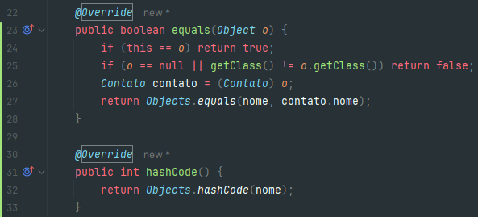
Em nosso exemplo vamos definir que a chave primária será a propriedade `nome` portanto esta não poderá ser repetida em nosso set.

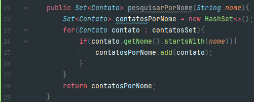
Implementando nosso método, podemos observar que seguimos uma estrutura muito parecida com os métodos de pesquisa em ArrayList. Neste método, queremos que retorne os contatos que começam com o nome por meio do método `.startsWith()`.
Diferente o método `.equalsIgnoreCase()` que utilizamos anteriormente, neste caso vamos retornar todos os contatos que começam com o `nome` inserido em nosso argumento.

#### Alterando elemento por Propriedade em Set

Para atualizar um contato em nosso set, primeiramente vamos precisar definir um método set em nossa classe `Contato`.

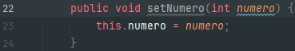

Na implementação do nosso método, devemos passar como argumento exatamente o nome que queremos alterar, portanto vamos utilizar o método `.equalsIgnoreCase()`.

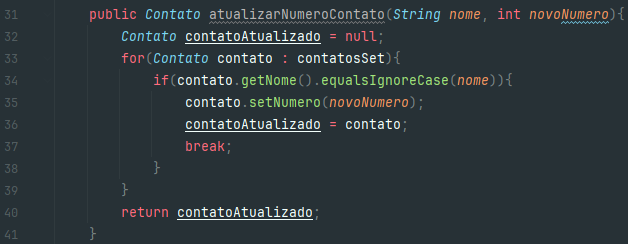
Por fim após encontrar o nome desejado, utilizamos nosso setter para alterar e armazenamos este contato atualizado em nossa variável `contatoAtualizado` e a retornamos.

### Ordenação em Set

Para exemplificar a ordenação de elementos em HashSet, vamos abstrair um sistema de cadastro de produtos.

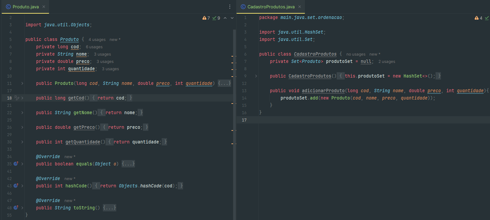
Definimos as classes `Produto` e `CadastroProduto` e seus respectivos métodos get, nossa chave primária será o código do produto e implementamos um método para adicionar produtos.

#### Ordenação por ordem alfabética em Set

Para ordenar um set por ordem alfabética, primeiramente precisamos implementar um `Comparable` na nossa classe `Produto`.

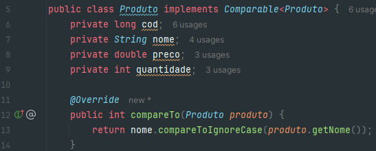
Implementando a classe `Comparable`, utilizamos o método `.compareToIgnoreCase()` da class wrapper `String` com `produto.getNome()` como parâmetro, tal método vai comparar se a string anterior fica antes ou após a string atual.

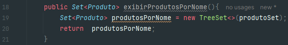
Como vimos anteriormente, um HashSet não pode ser ordenado pois armazena os elementos de forma aleatória, portanto devemos instanciar um `TreeSet<>()` para que seja possível esta ordenação.
Como definimos o `Comparable` anteriormente, precisamos apenas passar uma Collection como parâmetro na instanciação destre TreeSet, pois definimos a ordem natural deste Set.
Por fim retornamos este Set ordenado por ordem alfabética.

#### Ordenação por valores em Set

Para ordenar um set por valores (neste caso preço), vamos primeiramente implementar um `Comparator` em nossa classe `Produto`.

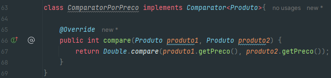
Definimos a classe `ComparatorPorPreco` e o método `compare` utiliza o método da class wrapper Double `.compare()` para receber os valores de preço do produto.

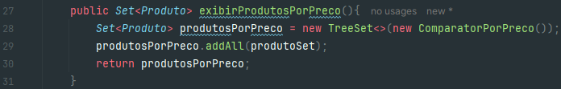
Por fim em nosso método vamos instanciar um TreeSet passando como argumento o nosso `ComparatorPorPreco()` e utilizamos o método `addAll()` para receber o nosso `produtoSet`.

## Map Interface

<p align="center">
<br>
<a href="https://data-flair.training/blogs/collection-framework-in-java/">Hierarchy of Collection Framework in Java </a>
</p>

- A interface `Map` é usada para mapear dados na forma de chaves e valores.
- O `Map` do Java é um objeto que mapeia chaves para valores.
- Um `Map` não pode conter chaves duplicadas: cada chave pode mapear no máximo um valor.
- A plataforma Java possui três implementações gerais de `Map`: `HashMap`, `TreeMap` e `LinkedHashMap`.
- As operações básicas do `Map` são: `put` (inserir ou atualizar), `get` (obter), `containsKey` (verificar se contém uma chave), `containsValue` (verificar se contém um valor), `size` (obter o tamanho) e `isEmpty` (verificar se está vazio).

> ##### *HashTable* é uma implementação antiga da interface Map no Java que é sincronizada e thread-safe, tornando-a adequada para uso em ambientes concorrentes. Ela não permite chaves ou valores nulos e os elementos não são mantidos em uma ordem específica.

> ##### *LinkedHashMap*, por outro lado, é uma implementação da interface Map que preserva a ordem de inserção dos elementos. Cada elemento possui referências ao próximo e ao anterior, formando uma lista encadeada. Isso permite que os elementos sejam iterados na ordem em que foram inseridos. Além disso, o LinkedHashMap também permite chaves ou valores nulos.

> ##### *HashMap* é uma implementação da interface Map que não mantém uma ordem específica dos elementos. Ele armazena os elementos internamente usando uma função de hash para melhorar a eficiência das operações de pesquisa e acesso. O HashMap também permite chaves ou valores nulos.

### Operações básicas em Map

Para este exemplo, vamos utilizar a abstração de uma agenda de contatos, mas diferente da agenda de contatos que fizemos no em HashSet, em Map não se faz necessário a criação de uma classe.

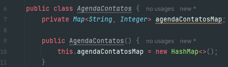
Note que os pares de chave/valor não aceitam tipos primitivos, portanto vamos utilizar as class wrappers String e Integer.

#### Adicionando elementos ao Map

Para adicionar elementos em um Map é muito parecido com as outras implementações de Collections.

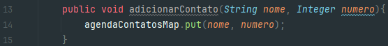
A diferença está no método que se chama `.put()` e ele recebe os pares de chave/valor.
*O método `put()` serve tanto para adicionar quanto para atualizar um elemento, portanto ao adicionar um elemento com uma chave existente, esta será substituida.*

#### Removendo elementos do Map

Podemos remover elementos de um Map passando apenas o valor da chave deste elemento.

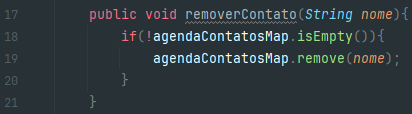
Note que diferente das interfaces anteriores, em um map não é necessário percorre-lo para encontrar este elemento, pois cada chave é única dentro de um Map.

#### Encontrando elemento pela chave de um Map

Para encontrar um elemento dentro de um Map utilizamos a chave para isso.

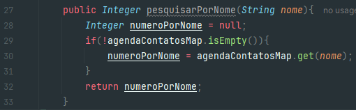
A interface Map possui um método `.get()` que retorna o valor da chave passada a ela.
Neste exemplo utilizamos para retornar o valor do número correspondente a chave.

### Pesquisa em Map

Para este exemplo vamos abstrair um sistema de estoque de produtos. Vamos utilizar um map com a chave sendo um código do produto e o valor um objeto produto.

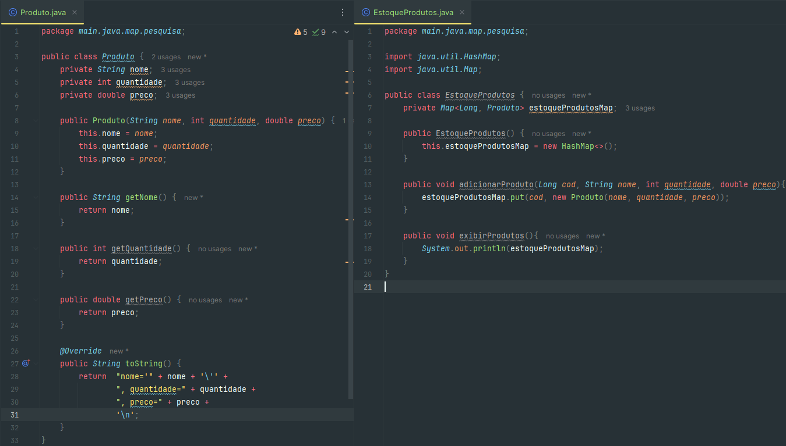
Note que em um map não é necessário definir um `equals() e hashCode()`, pois o Map já possui uma chave única.

#### Somando valores de um Map

Vamos implementar uma função que retorna o valor total de um estoque de produtos, portanto precisamos retornar o valor de um produto multiplicado pela sua quantidade e somado à mesma operação com todos estes valores.

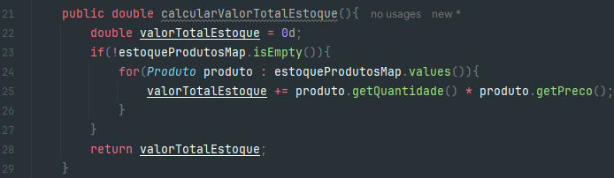
A interface Map possui um método chamado `.values()` que vai retornar apenas os valores contidos no map, pois para esta operação não nos interessa saber a chave destes valores.
Por fim fazemos a operação de multiplicar a quantidade pelo preço do valor e armazenamos este valor na variável `valorTotalEstoque` que será retornada ao fim do laço de repetição.

#### Obtendo maior e menor valor de um Map

Levando em consideração que estamos trabalhando com um sistema de estoque, precisamos saber qual o maior valor dentre os produtos contidos neste Map.

##### Maior valor

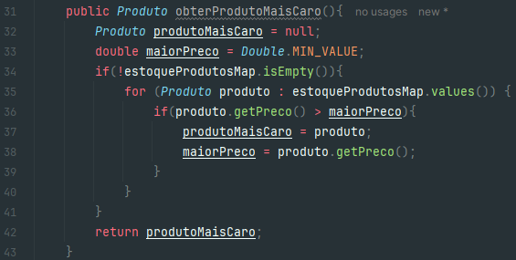
Neste método vamos percorrer o Map e comparar o preço do produto com a nossa variável `maiorPreco` que recebe um `.MIN_VALUE` em sua inicialização, pois desta forma independente do valor que for atribuido primeiramente a esta variável sempre será um valor maior.
A cada iteração do laço a variável `maiorPreco` recebe o valor do produto e a variável `produtoMaisCaro` recebe o objeto com o valor mais caro.
Por fim o método retorna o objeto mais caro dentro do Map.

##### Menor valor

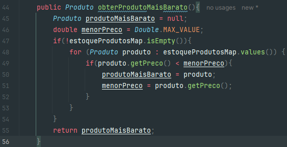
Da mesma forma que fizemos o método que retorna o maior valor, vamos apernas inverter a lógica para que o método retorne o menor valor contido no Map.

### Ordenação de Map

Para exemplificar a ordenação de valores em um Map, vamos abstrair uma agenda de eventos, sendo uma classe `Evento` com o nome do evento e nome da atração e uma classe `AgendaEventos` com um Map para armazenar as datas e respectivos eventos.

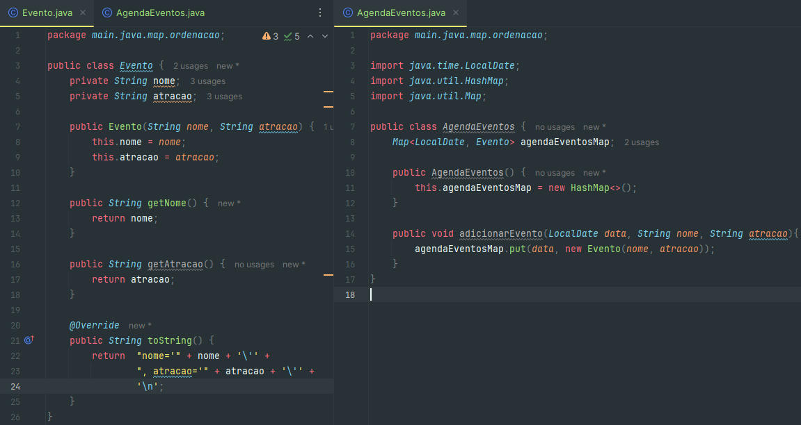

#### Ordenando um Map em ordem crescente

Podemos implementar um Comparator para definir a ordem que queremos este Map, mas a própria classe LocalDate possui um Comparator.

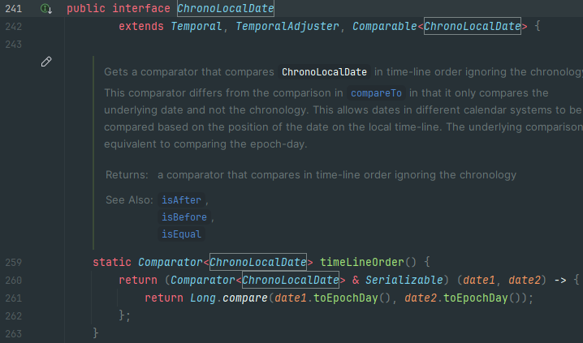
A classe LocalDate implementa a interface ChronoLocalDate que por sua vez já possui um Comparable.

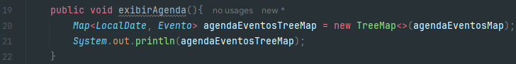
Portanto se passarmos nosso Map como parâmetro na instanciação do TreeMap, este já vai ter uma ordem natural implementada na sua chave e por se tratar de um TreeMap, será instanciado na ordem crescente naturalmente.

#### Obtendo o próximo elemento mais recente em Map

Vamos imaginar que queremos obter o evento mais próximo da sua data atual dentro deste Map.
O Método não deve retornar um evento anterior a sua data atual, portanto devemos estabelecer esta regra de negócio.

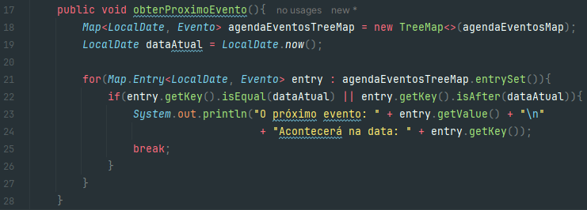
Utilizamos para fazer o laço de repetição o método `.Entry` da interface Map, tal método vai permitir que a cada iteração do laço tenhamos um par de chave/valor.
Dessa forma conseguimos comparar com a nossa `dataAtual` então faremos a condicional se a data da entrada `entry` é igual a `dataAtual` OU está após `isAfter()` a nossa `dataAtual`.
Feito isso vamos imprimir o evento mais próximo da nossa `dataAtual`.
Por estarmos utilizando o TreeMap, este já vem naturalmente ordenado como foi feito no tópico anterior.

---

# Stream API

Java é uma linguagem orientada a objeto, mas a partir do Java 8 e com a Stream API é possível trabalhar com programação funcional em Java.

## Programação Imperativa X Programação Declarativa

- A Streams API traz uma nova opção para a manipulação de coleções em Java seguindo os princípios da programação funcional.
- Stream, trata-se de uma poderosa solução para processar coleções de maneira declarativa, ao invés da tradicional e burocrática forma imperativa.

```java
public class CarrinhoDeCompras {
  //atributos
  private List<Item> itemList;
  //construtor
  public CarrinhoDeCompras() {
    this.itemList = new ArrayList<>();
  }
  
  //método para calcular valor total dos itens sem utilizar o Stream API
  public double calcularValorTotal() {
    double valorTotal = 0d;
    if (!itemList.isEmpty()) {
      for (Item item : itemList) {
        double valorItem = item.getPreco() * item.getQuant();
        valorTotal += valorItem;
      }
      return valorTotal;
    } else {
      throw new RuntimeException("A lista está vazia!");
    }
  }
}
```

- Na forma imperativa, para realizar uma soma simples, por exemplo, o desenvolvedor tem que se preocupar não apenas com o que deve ser feito em cada elemento, isto é, com as regras associadas ao processamento dos elementos da lista, mas também com a maneira de realizar essa iteração.

```java
public class CarrinhoDeCompras {
  //atributos
  private List<Item> itemList;
  //construtor
  public CarrinhoDeCompras() {
    this.itemList = new ArrayList<>();
  }
  
  //método para calcular valor total dos itens utilizando o Stream API
  public double calcularValorTotal() {
    if (itemList.isEmpty()) {
      throw new RuntimeException("A lista está vazia!");
    }
    return itemList.stream()
        .mapToDouble(item -> item.getPreco() * item.getQuant())
        .sum();
  }
}
```
- Combinada com as Expressões Lambda e Method reference, eles proporcionam uma forma diferente de lidar com conjuntos de elementos, oferecendo ao desenvolvedor uma maneira simples e concisa de escrever código que resulta em facilidade de manutenção e paralelização sem efeitos indesejados em tempo de execução.
- As operações na Stream API podem ser classificadas em duas categorias principais: 
1. Operações Intermediárias: são aquelas que retornam uma nova Stream e permitem encadear várias operações, formando um pipeline de processamento de dados. São elas:
- `filter(Predicate<T> predicate)`: Filtra os elementos da Stream com base em um predicado. Retorna uma nova Stream contendo apenas os elementos que atendem ao critério do predicado.
Exemplo: ` stream.filter(n -> n > 5)`
- `map(Function<T, R> mapper)`: Transforma cada elemento da Stream usando a função especificada e retorna uma nova Stream contendo os elementos resultantes.
Exemplo: `stream.map(s -> s.toUpperCase())`
- `sorted()`: Classifica os elementos da Stream em ordem natural (se os elementos forem comparáveis) ou de acordo com um comparador fornecido.
Exemplo: `stream.sorted()`
- `distinct()`: Remove elementos duplicados da Stream, considerando a implementação do método equals() para comparação.
Exemplo: `stream.distinct()`
- `limit(long maxSize)`: Limita o número de elementos da Stream aos maxSize primeiros elementos
Exemplo: stream.limit(10)
- `skip(long n)`: Pula os primeiros n elementos da Stream e retorna uma nova Stream sem eles.
Exemplo: `stream.skip(5)`
2. Operações Terminais: são aquelas que encerram o pipeline e produzem um resultado final. São elas:
- `forEach(Consumer<T> action)`: Executa uma ação para cada elemento da Stream.
Exemplo: `stream.forEach(System.out::println)`
- `toArray()`: Converte a Stream em um array contendo os elementos da Stream.
Exemplo: `stream.toArray()`
- `collect(Collector<T, A, R> collector)`: Coleta os elementos da Stream em uma estrutura de dados específica, como uma lista ou um mapa.
Exemplo: stream.collect(Collectors.toList())
- `count()`: Retorna o número de elementos na Stream.
Exemplo: `stream.count()`
- `anyMatch(Predicate<T> predicate)`: Verifica se algum elemento da Stream atende ao predicado especificado.
Exemplo: `stream.anyMatch(s -> s.startsWith("A"))`
- `allMatch(Predicate<T> predicate)`: Verifica se todos os elementos da Stream atendem ao predicado especificado.
Exemplo: `stream.allMatch(n -> n > 0)`
- `noneMatch(Predicate<T> predicate)`: Verifica se nenhum elemento da Stream atende ao predicado especificado.
Exemplo: stream.noneMatch(s -> s.isEmpty())
- `min(Comparator<T> comparator)` e `max(Comparator<T> comparator)`: Encontra o elemento mínimo e máximo da Stream, respectivamente, de acordo com o comparador fornecido.
Exemplo: `stream.min(Comparator.naturalOrder())` ou `stream.max(Comparator.naturalOrder())`
- `reduce(T identity, BinaryOperator<T> accumulator)`: Combina os elementos da Stream usando o acumulador especificado e retorna o resultado final.
Exemplo: `stream.reduce(0, (a, b) -> a + b)`

## Lambda Expressions

- As expressões lambda permitem representar interfaces funcionais (interfaces com um único método abstrato) de forma mais concisa e possibilitam escrever código no estilo funcional.
- As interfaces funcionais desempenham um papel crucial na programação funcional em Java, pois servem de base para o uso de expressões lambda.
- Uma função lambda é uma função sem declaração, isto é, não é necessário colocar um nome, um tipo de retorno e o modificador
de acesso. A ideia é que o método seja declarado no mesmo lugar em que será usado.
- As funções lambda em Java tem a sintaxe definida como (argumento) -> (corpo).

```java
public class OrdenacaoPessoa {
  //atributo
  private List<Pessoa> pessoaList;

  //construtor
  public OrdenacaoPessoa() {
    this.pessoaList = new ArrayList<>();
  }

  public List<Pessoa> ordenarPorAltura() {
    if (!pessoaList.isEmpty()) {
      List<Pessoa> pessoasPorAltura = new ArrayList<>(pessoaList);
      pessoasPorAltura.sort((p1, p2) -> Double.compare(p1.getAltura(), p2.getAltura()));
      return pessoasPorAltura;
    } else {
      throw new RuntimeException("A lista está vazia!");
    }
  }
}
```

## Method Reference

- Method Reference é um novo recurso do Java 8 que permite fazer referência a um método ou construtor de uma classe (de forma
funcional) e assim indicar que ele deve ser utilizado num ponto específico do código, deixando-o mais simples e legível.
- Para utilizá-lo, basta informar uma classe ou referência seguida do símbolo “::” e o nome do método sem os parênteses no final.

```java
public class OrdenacaoPessoa {
  //atributo
  private List<Pessoa> pessoaList;

  //construtor
  public OrdenacaoPessoa() {
    this.pessoaList = new ArrayList<>();
  }

  public List<Pessoa> ordenarPorAltura() {
    if (!pessoaList.isEmpty()) {
      List<Pessoa> pessoasPorAltura = new ArrayList<>(pessoaList);
      pessoasPorAltura.sort(Comparator.comparingDouble(Pessoa::getAltura));
      return pessoasPorAltura;
    } else {
      throw new RuntimeException("A lista está vazia!");
    }
  }
}
```
## Functional Interface

Qualquer interface com um SAM (Single Abstract Method) é uma interface funcional e sua implementação pode ser tratada
como
expressões lambda.

### Consumer

- `Consumer<T>`: Representa uma operação que aceita um argumento do tipo T e não retorna nenhum resultado. É utilizada
  principalmente para realizar ações ou efeitos colaterais nos elementos do Stream sem modificar ou retornar um valor.

```java
public class ConsumerExample {
  public static void main(String[] args) {
    // Criar uma lista de números inteiros
    List<Integer> numeros = Arrays.asList(1, 2, 3, 4, 5);

    // Usar o Consumer com expressão lambda para imprimir números pares
    Consumer<Integer> imprimirNumeroPar = numero -> {
      if (numero % 2 == 0) {
        System.out.println(numero);
      }
    };

    // Usar o Consumer para imprimir números pares no Stream
    numeros.stream_api().forEach(imprimirNumeroPar);
  }
}
```
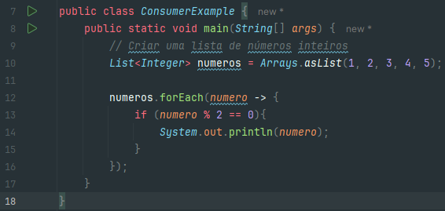
Utilizando o Stream API e uma Lambda Expression podemos apenas chamar o método `.forEach` e dentro dele como argumento passar uma Lambda Expression que recebe de argumento `numero` e então segue o corpo do consumer declarado anteriormente. Desta forma temos uma função declarada dentro de um argumento diminuindo severamente o número de linhas de código.


### Supplier

- `Supplier<T>`: Representa uma operação que não aceita nenhum argumento e retorna um resultado do tipo T. É comumente
  usada para criar ou fornecer novos objetos de um determinado tipo.

```java
public class SupplierExample {
  public static void main(String[] args) {
    // Usar o Supplier com expressão lambda para fornecer uma saudação personalizada
    Supplier<String> saudacao = () -> "Olá, seja bem-vindo(a)!";

    // Usar o Supplier para obter uma lista com 5 saudações
    List<String> listaSaudacoes = Stream.generate(saudacao)
        .limit(5)
        .collect(Collectors.toList());

    // Imprimir as saudações geradas
    listaSaudacoes.forEach(System.out::println);
  }
}
```

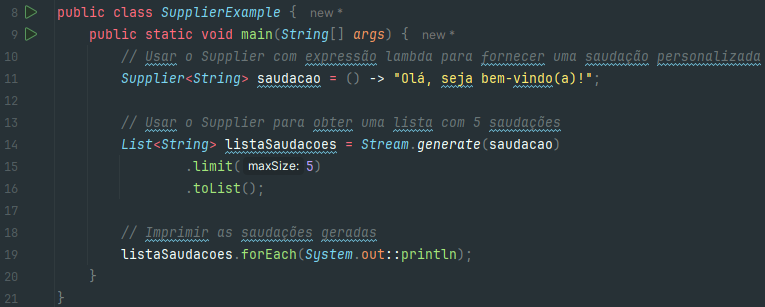
O Collector no Stream API pode ser substituido apenas pelo `.toList`, podendo assim resumir a declaração dele, desta forma a Stream API vai utilizar um Method Reference em seu `forEach` para imprimir no console uma mensagem declarada em nosso Supplier.
Note que a Stream gera uma lista de strings sem a necessidade desta ser instanciada, passando apenas o seu limite de elementos e a Supplier.

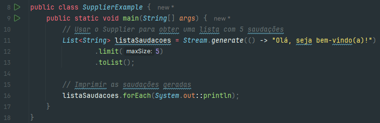
Utilizando uma Lambda Expression, podemos dispensar a declaração do Supplier e apenas declarar a Lambda Expression sem nenhum argumento com seu retorno implícito que neste caso é uma String.

### Function

- `Function<T, R>`: Representa uma função que aceita um argumento do tipo T e retorna um resultado do tipo R. É
  utilizada para transformar ou mapear os elementos do Stream em outros valores ou tipos.

```java
public class FunctionExample {
  public static void main(String[] args) {
    // Criar uma lista de números inteiros
    List<Integer> numeros = Arrays.asList(1, 2, 3, 4, 5);

    // Usar a Function com expressão lambda para dobrar todos os números
    Function<Integer, Integer> dobrar = numero -> numero * 2;

    // Usar a função para dobrar todos os números no Stream e armazená-los em outra lista
    List<Integer> numerosDobrados = numeros.stream_api()
        .map(dobrar)
        .collect(Collectors.toList());

    // Imprimir a lista de números dobrados
    numerosDobrados.forEach(System.out::println);
  }
}
```


Utilizando Lambda Expression em nosso código podemos dispensar a declaração da funcion por apenas a Lambda Expression `numero -> numero * 2` que vai se encarregar de dobrar cada número e armazená-los em uma lista com a Stream API.

### Predicate

- `Predicate<T>`: Representa uma função que aceita um argumento do tipo T e retorna um valor booleano (verdadeiro ou
  falso). É comumente usada para filtrar os elementos do Stream com base em alguma condição.

```java
public class PredicateExample {
  public static void main(String[] args) {
    // Criar uma lista de números inteiros
    List<Integer> numeros = Arrays.asList(1, 2, 3, 4, 5, 6, 7, 8, 9, 10);

    // Usar o Predicate com expressão lambda para filtrar números pares
    Predicate<Integer> isPar = numero -> numero % 2 == 0;

    // Usar o predicado para filtrar números pares no Stream e armazená-los em outra lista
    List<Integer> numerosPares = numeros.stream_api()
        .filter(isPar)
        .collect(Collectors.toList());

    // Imprimir a lista de números pares
    numerosPares.forEach(System.out::println);
  }
}
```

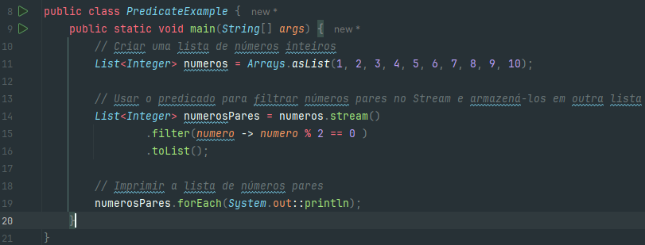
Com a Lambda Expression já podemos implementar a lógica do Predicate dentro do nosso `.filter()` dispensando a sua declaração.

### BinaryOperator

- `BinaryOperator<T>`: Representa uma operação que combina dois argumentos do tipo T e retorna um resultado do mesmo
  tipo T. É usada para realizar operações de redução em pares de elementos, como somar números ou combinar objetos.

```java
public class BinaryOperatorExample {
  public static void main(String[] args) {
    // Criar uma lista de números inteiros
    List<Integer> numeros = Arrays.asList(1, 2, 3, 4, 5);

    // Usar o BinaryOperator com expressão lambda para somar dois números inteiros
    BinaryOperator<Integer> somar = (num1, num2) -> num1 + num2;

    // Usar o BinaryOperator para somar todos os números no Stream
    int resultado = numeros.stream_api()
        .reduce(0, somar);

    // Imprimir o resultado da soma
    System.out.println("A soma dos números é: " + resultado);
  }
}
```

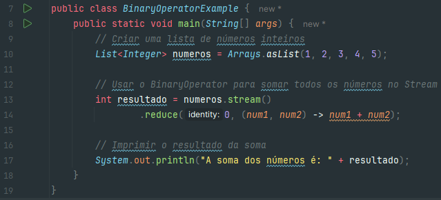
Podemos utilizar uma Lambda Expression para substituir a declaração do BinaryOperator e diminuir as linhas de código.

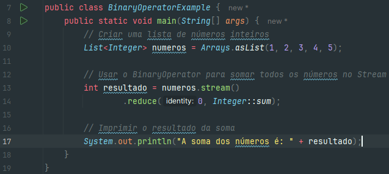
Indo além podemos utilizar um Method Reference com a Class Wrapper `Integer` e utilizar o método `sum` para fazer a soma destes valores.


> _Classe Anônima_:
> A classe anônima em Java é uma classe não recebeu um nome e é tanto declarado e instanciado em uma única instrução.
> Você deve considerar o uso de uma classe anônima sempre que você precisa para criar uma classe que será instanciado
> apenas uma vez.

### Class Optional

O objetivo da classe Optional no Java é fornecer uma abordagem mais segura e expressiva para tratar casos em que um valor pode ser ausente (nulo). 
Ela foi introduzida a partir do Java 8 para evitar o temido NullPointerException (NPE) que é comum quando se trabalha com referências nulas. Optional permite encapsular um valor que pode ser nulo dentro de um objeto Optional. Isso indica explicitamente que o valor pode ou não estar presente e requer que o código que deseja acessá-lo faça uma verificação explícita.
<br>
- `of(value)`: Cria um Optional contendo o valor fornecido. Se o valor for nulo, lançará uma exceção NullPointerException.

```java
Optional<String> optionalValue = Optional.of("Hello");
System.out.println(optionalValue.get());
```

- `ofNullable(value)`: Cria um Optional contendo o valor fornecido, mas permite que o valor seja nulo.

```java
String nullableValue = null;
Optional<String> optionalValue = Optional.ofNullable(nullableValue);
System.out.println(optionalValue.isPresent());
```
- `empty()`: Retorna um Optional vazio (sem valor).

```java
Optional<String> optionalValue = Optional.empty();
System.out.println(optionalValue.isPresent());
```

- `isPresent()`: Verifica se o Optional contém um valor não nulo.

```java
Optional<String> optionalValue = Optional.of("Hello");
System.out.println(optionalValue.isPresent());
```

- `isEmpty()` (A partir do Java 11): Verifica se o Optional está vazio (não contém um valor não nulo).

```java
Optional<String> optionalValue = Optional.ofNullable(null);
System.out.println(optionalValue.isEmpty());
```

- `get()`: Obtém o valor contido no Optional. Se o valor for nulo, lançará uma exceção NoSuchElementException.

```java
Optional<String> optionalValue = Optional.of("Hello");
System.out.println(optionalValue.get());
```

- `orElse(defaultValue)`: Obtém o valor contido no Optional, ou retorna um valor padrão se o Optional estiver vazio

```java
Optional<String> optionalValue = Optional.ofNullable(null);
String result = optionalValue.orElse("Default"); 
System.out.println(result);
```

- `orElseGet(supplier)`: Obtém o valor contido no Optional, ou retorna um valor fornecido por um Supplier se o Optional estiver vazio.

```java
Optional<String> optionalValue = Optional.ofNullable(null);
String result = optionalValue.orElseGet(() -> "Value from Supplier");
System.out.println(result);
```
- `orElseThrow(exceptionSupplier)`: Obtém o valor contido no Optional, ou lança uma exceção fornecida por um Supplier se o Optional estiver vazio.

```java
Optional<String> optionalValue = Optional.ofNullable(null);
String result = optionalValue.orElseThrow(() -> new RuntimeException("Value not present"));
```

- `ifPresent(consumer)`: Executa uma ação fornecida por um Consumer se o Optional contiver um valor.

```java
Optional<String> optionalValue = Optional.of("Hello");
optionalValue.ifPresent(value -> System.out.println("Valor presente: " + value));
```
