# Anatomia da Classe

A escrita de códigos de um programa e feito atraves da composição de palavras pré-definidas pela linguagem com as expressões que utilizamos para determinar o nome dos nossos arquivos, classes, atributos e métodos.

Existem projetos que recomendam que toda a implementação do seu programa seja escrita na língua inglesa.

## Sintaxe de declaração de uma nova classe

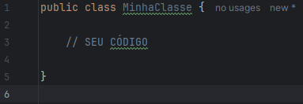
Toda classe java possui seus modificadores de acesso `public class` e o seu nome. Dentro das chaves é onde fica todo o seu código.

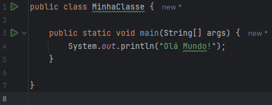
Para que o java execute nosso código precisamos de um método main, que é onde temos todo nosso código executável.

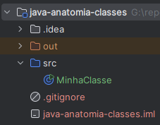
Todo seu código escrito  na classe deve estar na pasta src(source) do seu projeto. Assim indicando que temos o arquivo principal do projeto.

## Padrão de nomeclatura

QUando se trata de escrever códigos na linguagem Java, é recomendado seguir algumas convenções de escrita. Esses padrões estão expressos nos itens abaixo:

* __Arquivo .java:__ Todo arquivo .java deve começar com eltra MAIÚSCULA.
Se a palavra for composta, a segunda palavra deve também ser maiúscula, exemplo:
`Calculadora.java`, `CalculadoraCientifica.java`

* __Nome a classe no arquivo:__ A classe deve possuir o mesmo nome do arquivo.java, exemplo:
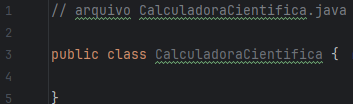

* __Nome de variável:__ toda variável deve ser escrita com letra minúscula, porém se a palavra for composta, a primeira letra da segunda palavra deverá ser MAIÚSCULA, exemplo:
`ano` e `anoFabricacao`

* __Convenção de variável final:__ existe uma convenção que diz que variáveis que não devem ser alteradas devem ser escritas em letra MAIÚSCULA acompanhadas do modificador final, exemplo:
`final String BR = "Brasil"`. Sabemos que brasil não deve ser escrito com z quando se tratando de códigos escritos em português, portanto definimos esta variável como final e seu nome é escrito em maiúsculo

## Declarando variáveis e métodos

Declarar variáveis em Java segue sempre a seguinte estrutura:

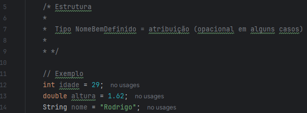
Teremos sempre o seu tipo, nome e a sua atribuição.

Declarar métodos em Java segue sempre a seguinte estrutura:

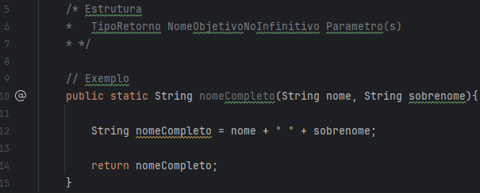
Teremos sempre o seu modificador de acesso, o tipo de retorno, nome do método e seus parâmetros.

## Organizando arquivos

À medida que nossos sistema vai evoluindo, surgem novos arquivos em nossa estrutura de arquivos do projeto. Isso exige que seja realizado uma organização destes arquivos através de pacotes (packages).

Existe uma convenção para os subdiretórios que segue um padrão de nomeclatura. Às empresas costumam ter segmentos comerciais, organizacionais ou até opensource, com isso o nome destes pacotes seguem este segmento, exemplo:

    comercial      - com.nomeempresa.nomeprojeto
    organizacional - org.nomeempresa.nomeprojeto
    opensource     - opensource.nomeempresa.nomeprojeto

Tais nomes de pacotes vão servir para diferentes tipos de aplicações, sejam elas para seu app principal, APIs de validação ou utilidades.

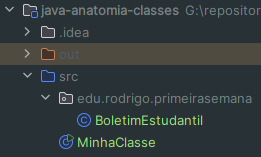
Ao criar um novo pacote em nosso projeto, note que utilizamos a nomeclatura de exemplo vista acima, teremos que declarar a qual pacote esta classe pertence.
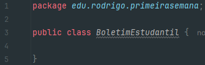
Na linha 1 da nossa classe declaramos este pacote.

---

# Tipos e Variáveis

## Tipos de dados

No Java, existem algumas palavras reservadas para a representação de tipos de dados básicos que precisam ser manipulados para a construção de programas. Estes tipos de dados são conhecidos como tipos primitivos.

**Os oito tipos primitivos em Java são:**

| Tipo       | Descrição                                                                 |
|------------|---------------------------------------------------------------------------|
| `byte`     | Inteiro de 8 bits com sinal. Valor mínimo de -128 e máximo de 127.        |
| `short`    | Inteiro de 16 bits com sinal. Valor mínimo de -32.768 e máximo de 32.767. |
| `int`      | Inteiro de 32 bits com sinal. Valor mínimo de -2^31 e máximo de 2^31-1.   |
| `long`     | Inteiro de 64 bits com sinal. Valor mínimo de -2^63 e máximo de 2^63-1.   |
| `float`    | Ponto flutuante de precisão simples de 32 bits.                           |
| `double`   | Ponto flutuante de precisão dupla de 64 bits.                             |
| `boolean`  | Representa um valor lógico: `true` ou `false`.                            |
| `char`     | Caractere Unicode de 16 bits. Valor mínimo de '\u0000' e máximo de '\uffff'.|

Esses tipos não são considerados objetos, e portanto representam valores brutos. Eles são armazenados diretamente na pilha de memória.

**Atenção:** existe algumas peculiaridades a trabalhar com alguns tipos específicos. Observe no exemplo abaixo:
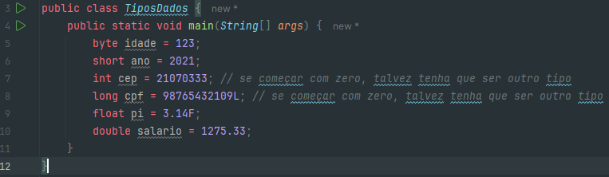
Observe que o tipo long precisa terminar com L, e o tipo float precisa terminar com F e alguns cenários do dia-a-dia podem estimular uma alteração de tipos de dados convencional.

## Casting

Por Java se tratar de uma linguagem fortemente tipada, alguns conflitos entre variáveis podem acontecer. É o caso de quando vamos atribuir uma variável `short` dentro de uma variável `int`.
No caso de `short` para `int` é possível fazer esta atribuição, pois um `short` cabe dentro de um `int`, isso é chamado de casting implicito, mas o contrário não é possível.

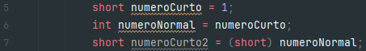
Neste caso precisamos fazer um casting, colocando entre parênteses o tipo que esta variável atribuida sofrerá o casting.

## Variáveis e Constantes

Uma **variável** é uma área de memória, associada a um nome, que pode armazenar valores de um determinado tipo. um tipo de dado define um conjunto de valores e um conjunto de operações. **Java** é uma linguagem com rigidez de tipos, diferente de linguagens como JavaScript, onde declarar o tipo da variável não é obrigatório.

no Java utilizamos identificadores que representam uma referência(ponteiro) a um valor em memória, e esta referência pode ser redirecionada a outro valor, sendo portanto esta a causa do nome "variável", pois o valor pode variar.

Já as **Constantes** são valores armazenados em memória que não podem ser modificados depois de declarados. Em Java, esses valores são representados pela palavra reservada `final`, seguida do tipo.

Por convenção, **Constantes** são sempre escritas em CAIXA ALTA.

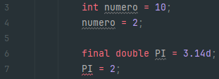
Observe que no caso da variável `numero` nós podemos atribuir outro valor a ela, mas no caso da constante `PI` ocorre um erro ao tentar atribuir outro valor.

---

# Operadores

Símbolos especiais que tem um significado próprio ara a linguagem e estão associados a determinadas operações.

## Operador de Atribuição

Representado pelo símbolo de igualdade `=`.

O operador de atribuição é utilizado para definir o valor inicial ou sobrescrever o valor de uma variável. Em Java definimos um tipo, nome e opcionalmente atribuímos um valor à variável através do operador de atribuição. Esemplos abaixo:
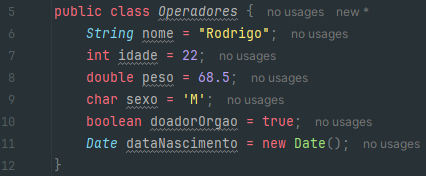

## Operadores Aritméticos

O operador aritmético é utilizado para realizar operações matemáticas entre valores numéricos, podendo se tornar ou não uma expressão mais complexa.

### Tabela de operadores ariméticos

| Operador | Descrição                               | Exemplo         | Resultado do Exemplo |
|----------|-----------------------------------------|-----------------|----------------------|
| `+`      | Adição                                  | `5 + 3`         | `8`                  |
| `-`      | Subtração                               | `5 - 3`         | `2`                  |
| `*`      | Multiplicação                           | `5 * 3`         | `15`                 |
| `/`      | Divisão (retorna o quociente)           | `5 / 3`         | `1`                  |
| `%`      | Módulo (retorna o resto da divisão)     | `5 % 3`         | `2`                  |

## Operadores Unários

Esses operadores são aplicados juntamente com um outro operador aritmético. Eles realizam alguns trabalhos básicos como incrementar, decrementar, inverter valores numéricos e booleanos.

### Tabela de operadores Unários

| Operador | Descrição                                      | Exemplo          | Resultado do Exemplo    |
|----------|------------------------------------------------|------------------|-------------------------|
| `+`      | Operador unário positivo (não faz alteração)   | `int a = +5;`    | `a` é `5`               |
| `-`      | Operador unário negativo (nega o valor)        | `int a = -5;`    | `a` é `-5`              |
| `++`     | Incremento (incrementa em 1)                   | `int a = 5; a++;`| `a` se torna `6`        |
| `--`     | Decremento (decrementa em 1)                   | `int a = 5; a--;`| `a` se torna `4`        |
| `!`      | Negação lógica                                 | `boolean b = !true;` | `b` é `false`     |
| `~`      | Complemento bit a bit (inverte os bits)        | `int a = ~5;`    | `a` é `-6` (em complemento a dois) |
| `(type)` | Conversão de tipo (casting)                    | `int a = (int) 3.5;` | `a` é `3`        |

## Operador Ternário

O Operador de Condição Ternária é uma forma resumida para definir uma condição e escolher por um dentre dois valores. Você deve pensar numa condição ternária como se fosse condição IF normal, porém, de uma forma em que toda a sua estrutura estará escrita numa única linha.

O operador ternário é representado pelos símbolos `?:` utilizados na seguinte estrutura de sintaxe:
`<Expressão Condicional> ? <Caso condição seja true> : <Caso condição seja false>`

Exemplo abaixo:
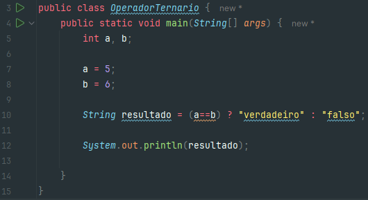
Podemos observar que fizemos uma estrutura condicional If-Else sem utilizar os operadores lógicos.

## Operadores Relacionais

Os operadores relacionais avaliam a relação entre duas variáveis ou expressões. Neste caso, mais precisamente, definem se o operando à esquerda é igual, diferente, menor, menr ou igual, maior, maior ou igual ao da direita, retornando um valor booleano como resultado.

### Tabela de Operadores Relacionais

| Operador | Descrição                                | Exemplo          | Resultado do Exemplo |
|----------|------------------------------------------|------------------|----------------------|
| `==`     | Igualdade                                | `5 == 3`         | `false`              |
| `!=`     | Desigualdade                             | `5 != 3`         | `true`               |
| `>`      | Maior que                                | `5 > 3`          | `true`               |
| `<`      | Menor que                                | `5 < 3`          | `false`              |
| `>=`     | Maior ou igual a                         | `5 >= 3`         | `true`               |
| `<=`     | Menor ou igual a                         | `5 <= 3`         | `false`              |

## Operadores Lógicos

Os operadores lógicos representam o recurso que nos permite criar expressões lógicas maiores a partir a junção de duas ou mais expressões.

### Tabela de Operadores Lógicos

| Operador | Descrição                                  | Exemplo              | Resultado do Exemplo |
|----------|--------------------------------------------|----------------------|----------------------|
| `&&`     | AND lógico (retorna verdadeiro se ambos os operandos forem verdadeiros) | `true && false`      | `false`              |
| `\|\|`     | OR lógico (retorna verdadeiro se pelo menos um dos operandos for verdadeiro) | `true \|\| false`  | `true`               |

---

# Métodos
