# Anatomia da Classe

A escrita de códigos de um programa e feito atraves da composição de palavras pré-definidas pela linguagem com as expressões que utilizamos para determinar o nome dos nossos arquivos, classes, atributos e métodos.

Existem projetos que recomendam que toda a implementação do seu programa seja escrita na língua inglesa.

## Sintaxe de declaração de uma nova classe

Toda classe java possui seus modificadores de acesso `public class` e o seu nome. Dentro das chaves é onde fica todo o seu código.

Para que o java execute nosso código precisamos de um método main, que é onde temos todo nosso código executável.

Todo seu código escrito  na classe deve estar na pasta src(source) do seu projeto. Assim indicando que temos o arquivo principal do projeto.

## Padrão de nomeclatura

QUando se trata de escrever códigos na linguagem Java, é recomendado seguir algumas convenções de escrita. Esses padrões estão expressos nos itens abaixo:

* __Arquivo .java:__ Todo arquivo .java deve começar com eltra MAIÚSCULA.
Se a palavra for composta, a segunda palavra deve também ser maiúscula, exemplo:
`Calculadora.java`, `CalculadoraCientifica.java`

* __Nome a classe no arquivo:__ A classe deve possuir o mesmo nome do arquivo.java, exemplo:

* __Nome de variável:__ toda variável deve ser escrita com letra minúscula, porém se a palavra for composta, a primeira letra da segunda palavra deverá ser MAIÚSCULA, exemplo:
`ano` e `anoFabricacao`

* __Convenção de variável final:__ existe uma convenção que diz que variáveis que não devem ser alteradas devem ser escritas em letra MAIÚSCULA acompanhadas do modificador final, exemplo:
`final String BR = "Brasil"`. Sabemos que brasil não deve ser escrito com z quando se tratando de códigos escritos em português, portanto definimos esta variável como final e seu nome é escrito em maiúsculo

## Declarando variáveis e métodos

Declarar variáveis em Java segue sempre a seguinte estrutura:

Teremos sempre o seu tipo, nome e a sua atribuição.

Declarar métodos em Java segue sempre a seguinte estrutura:

Teremos sempre o seu modificador de acesso, o tipo de retorno, nome do método e seus parâmetros.

## Organizando arquivos

À medida que nossos sistema vai evoluindo, surgem novos arquivos em nossa estrutura de arquivos do projeto. Isso exige que seja realizado uma organização destes arquivos através de pacotes (packages).

Existe uma convenção para os subdiretórios que segue um padrão de nomeclatura. Às empresas costumam ter segmentos comerciais, organizacionais ou até opensource, com isso o nome destes pacotes seguem este segmento, exemplo:

    comercial      - com.nomeempresa.nomeprojeto
    organizacional - org.nomeempresa.nomeprojeto
    opensource     - opensource.nomeempresa.nomeprojeto

Tais nomes de pacotes vão servir para diferentes tipos de aplicações, sejam elas para seu app principal, APIs de validação ou utilidades.

Ao criar um novo pacote em nosso projeto, note que utilizamos a nomeclatura de exemplo vista acima, teremos que declarar a qual pacote esta classe pertence.

Na linha 1 da nossa classe declaramos este pacote.

---

# Tipos e Variáveis

## Tipos de dados

No Java, existem algumas palavras reservadas para a representação de tipos de dados básicos que precisam ser manipulados para a construção de programas. Estes tipos de dados são conhecidos como tipos primitivos.

**Os oito tipos primitivos em Java são:**

| Tipo       | Descrição                                                                 |
|------------|---------------------------------------------------------------------------|
| `byte`     | Inteiro de 8 bits com sinal. Valor mínimo de -128 e máximo de 127.        |
| `short`    | Inteiro de 16 bits com sinal. Valor mínimo de -32.768 e máximo de 32.767. |
| `int`      | Inteiro de 32 bits com sinal. Valor mínimo de -2^31 e máximo de 2^31-1.   |
| `long`     | Inteiro de 64 bits com sinal. Valor mínimo de -2^63 e máximo de 2^63-1.   |
| `float`    | Ponto flutuante de precisão simples de 32 bits.                           |
| `double`   | Ponto flutuante de precisão dupla de 64 bits.                             |
| `boolean`  | Representa um valor lógico: `true` ou `false`.                            |
| `char`     | Caractere Unicode de 16 bits. Valor mínimo de '\u0000' e máximo de '\uffff'.|

Esses tipos não são considerados objetos, e portanto representam valores brutos. Eles são armazenados diretamente na pilha de memória.

**Atenção:** existe algumas peculiaridades a trabalhar com alguns tipos específicos. Observe no exemplo abaixo:

Observe que o tipo long precisa terminar com L, e o tipo float precisa terminar com F e alguns cenários do dia-a-dia podem estimular uma alteração de tipos de dados convencional.

## Casting

Por Java se tratar de uma linguagem fortemente tipada, alguns conflitos entre variáveis podem acontecer. É o caso de quando vamos atribuir uma variável `short` dentro de uma variável `int`.
No caso de `short` para `int` é possível fazer esta atribuição, pois um `short` cabe dentro de um `int`, isso é chamado de casting implicito, mas o contrário não é possível.

Neste caso precisamos fazer um casting, colocando entre parênteses o tipo que esta variável atribuida sofrerá o casting.

## Variáveis e Constantes

Uma **variável** é uma área de memória, associada a um nome, que pode armazenar valores de um determinado tipo. um tipo de dado define um conjunto de valores e um conjunto de operações. **Java** é uma linguagem com rigidez de tipos, diferente de linguagens como JavaScript, onde declarar o tipo da variável não é obrigatório.

no Java utilizamos identificadores que representam uma referência(ponteiro) a um valor em memória, e esta referência pode ser redirecionada a outro valor, sendo portanto esta a causa do nome "variável", pois o valor pode variar.

Já as **Constantes** são valores armazenados em memória que não podem ser modificados depois de declarados. Em Java, esses valores são representados pela palavra reservada `final`, seguida do tipo.

Por convenção, **Constantes** são sempre escritas em CAIXA ALTA.

Observe que no caso da variável `numero` nós podemos atribuir outro valor a ela, mas no caso da constante `PI` ocorre um erro ao tentar atribuir outro valor.

---

# Operadores

Símbolos especiais que tem um significado próprio ara a linguagem e estão associados a determinadas operações.

## Operador de Atribuição

Representado pelo símbolo de igualdade `=`.

O operador de atribuição é utilizado para definir o valor inicial ou sobrescrever o valor de uma variável. Em Java definimos um tipo, nome e opcionalmente atribuímos um valor à variável através do operador de atribuição. Esemplos abaixo:

## Operadores Aritméticos

O operador aritmético é utilizado para realizar operações matemáticas entre valores numéricos, podendo se tornar ou não uma expressão mais complexa.

### Tabela de operadores ariméticos

| Operador | Descrição                               | Exemplo         | Resultado do Exemplo |
|----------|-----------------------------------------|-----------------|----------------------|
| `+`      | Adição                                  | `5 + 3`         | `8`                  |
| `-`      | Subtração                               | `5 - 3`         | `2`                  |
| `*`      | Multiplicação                           | `5 * 3`         | `15`                 |
| `/`      | Divisão (retorna o quociente)           | `5 / 3`         | `1`                  |
| `%`      | Módulo (retorna o resto da divisão)     | `5 % 3`         | `2`                  |

## Operadores Unários

Esses operadores são aplicados juntamente com um outro operador aritmético. Eles realizam alguns trabalhos básicos como incrementar, decrementar, inverter valores numéricos e booleanos.

### Tabela de operadores Unários

| Operador | Descrição                                      | Exemplo          | Resultado do Exemplo    |
|----------|------------------------------------------------|------------------|-------------------------|
| `+`      | Operador unário positivo (não faz alteração)   | `int a = +5;`    | `a` é `5`               |
| `-`      | Operador unário negativo (nega o valor)        | `int a = -5;`    | `a` é `-5`              |
| `++`     | Incremento (incrementa em 1)                   | `int a = 5; a++;`| `a` se torna `6`        |
| `--`     | Decremento (decrementa em 1)                   | `int a = 5; a--;`| `a` se torna `4`        |
| `!`      | Negação lógica                                 | `boolean b = !true;` | `b` é `false`     |
| `~`      | Complemento bit a bit (inverte os bits)        | `int a = ~5;`    | `a` é `-6` (em complemento a dois) |
| `(type)` | Conversão de tipo (casting)                    | `int a = (int) 3.5;` | `a` é `3`        |

## Operador Ternário

O Operador de Condição Ternária é uma forma resumida para definir uma condição e escolher por um dentre dois valores. Você deve pensar numa condição ternária como se fosse condição IF normal, porém, de uma forma em que toda a sua estrutura estará escrita numa única linha.

O operador ternário é representado pelos símbolos `?:` utilizados na seguinte estrutura de sintaxe:
`<Expressão Condicional> ? <Caso condição seja true> : <Caso condição seja false>`

Exemplo abaixo:

Podemos observar que fizemos uma estrutura condicional If-Else sem utilizar os operadores lógicos.

## Operadores Relacionais

Os operadores relacionais avaliam a relação entre duas variáveis ou expressões. Neste caso, mais precisamente, definem se o operando à esquerda é igual, diferente, menor, menr ou igual, maior, maior ou igual ao da direita, retornando um valor booleano como resultado.

### Tabela de Operadores Relacionais

| Operador | Descrição                                | Exemplo          | Resultado do Exemplo |
|----------|------------------------------------------|------------------|----------------------|
| `==`     | Igualdade                                | `5 == 3`         | `false`              |
| `!=`     | Desigualdade                             | `5 != 3`         | `true`               |
| `>`      | Maior que                                | `5 > 3`          | `true`               |
| `<`      | Menor que                                | `5 < 3`          | `false`              |
| `>=`     | Maior ou igual a                         | `5 >= 3`         | `true`               |
| `<=`     | Menor ou igual a                         | `5 <= 3`         | `false`              |

## Operadores Lógicos

Os operadores lógicos representam o recurso que nos permite criar expressões lógicas maiores a partir a junção de duas ou mais expressões.

### Tabela de Operadores Lógicos

| Operador | Descrição                                  | Exemplo              | Resultado do Exemplo |
|----------|--------------------------------------------|----------------------|----------------------|
| `&&`     | AND lógico (retorna verdadeiro se ambos os operandos forem verdadeiros) | `true && false`      | `false`              |
| `\|\|`     | OR lógico (retorna verdadeiro se pelo menos um dos operandos for verdadeiro) | `true \|\| false`  | `true`               |

---

# Métodos

Uma classe é definida por atributos e métodos. Já vimos que atributos são, em sua grande maioria, variáveis de diferentes tipos e valores. Os métodos, por sua vez, correspondem a **funções** e **sub-rotinas** disponíveis dentro de nossas classes.

## Critério de nomeação de Métodos

Esses critérios não são obrigatórios, mas é recomendável que sejam seguidos, pois essas convenções facilitam a vida dos programadores ao trabalharem em códigos de forma colaborativa. Ao seguir estas convenções, tornamos o código mais legível para nós e também para outras pessoas. Para métodos, os critérios são:

* Deve ser nomeado como verbo
* Seguir o padrão camelCase

Exemplos sugeridos para nomeclatura de métodos:

    somar(int n1, int n2){}

    abrirConexão(){}

    concluirProcessamento(){}

    findById(int id){}

    calcularImprimir(){} // há algo errado neste método,
                            ele deveria fazer somente uma coisa

## Critério de definição de métodos

Mas, como sabemos a melhor forma de definir os métodos das nossas classes? Para chegar à essa conclusão, somos auxiliados por uma convemção estrutural para todos os métodos. Essa convenção é determinada pelos aspectos abaixo:

1. **Qual a proposta principal do método?** Você deve se perguntar constantemente até compreender a real finalidade do mesmo.
2. **Qual o tipo de retorno esperado após executar o método?** Você deve analisar se o método será responsável por retornar algum valor ou não.
*Caso o método não retorne nenhum valor, ele será representado pela palavra-chave `void`.*
3. **Quais parâmetros serão necessários para execução do método?** Os métodos as vezes precisarão de argumentos como critérios para a execução.
4. **O método possui risco de apresentar alguma exceção?** Exceções são comuns na execução de métodos, as vezes é necessário prever e tratar a possível existência de uma exceção.
5. **Qual a visibilidade do método?** Será necessário que o método seja visível a toda aplicação, somente em mesmo pacotes, através de herança ou somente a nível da própria classe.

Abaixo temos um exemplo de uma classe com métodos e suas respectivas considerações:

---

# Escopo

O escopo pode ser entendido como o ambiente onde uma variável pode ser acessada. Em Java, o escopo de variáveis **vai de acordo com o bloco onde ela foi declarada**.

Variáveis quando criadas no primeiro acesso, só podem ser acessadas durante a execução do bloco de código, quando o interpretador sai da execução do bloco, tal variável não pode ser mais acessada.

Exemplo de variáveis de escopo:

---

# Palavras reservadas

Palavras reservadas são identificadores de uma linguagem que já possuem uma finalidade específica, portanto não podem ser utilizados para nomear variáveis, classes, métodos ou atributos.

Tais palavras reservadas são classificadas em grupos e escritas em minúsculo. A maioria das IDEs exibem elas com cores diferentes para identificação.

## Controladores de Fluxo
| Palavra Reservada | Descrição                                                                                          |
|-------------------|----------------------------------------------------------------------------------------------------|
| `if`              | Testa uma condição lógica.                                                                         |
| `else`            | Especifica a cláusula alternativa de um if statement.                                              |
| `switch`          | Inicia um switch statement.                                                                        |
| `case`            | Rotula uma constante no switch statement.                                                          |
| `default`         | Especifica a cláusula padrão em um switch statement.                                               |
| `while`           | Inicia um laço while.                                                                              |
| `do`              | Inicia um laço do-while.                                                                           |
| `for`             | Inicia um laço for.                                                                                |
| `break`           | Interrompe o laço ou switch em execução.                                                           |
| `continue`        | Continua a próxima iteração do laço.                                                               |
| `return`          | Retorna um valor de um método.                                                                     |

## Manipulação de Exceções
| Palavra Reservada | Descrição                                                                                          |
|-------------------|----------------------------------------------------------------------------------------------------|
| `try`             | Inicia um bloco de código que será monitorado quanto a exceções.                                   |
| `catch`           | Captura exceções geradas por blocos try.                                                           |
| `finally`         | Bloco de código, geralmente após um bloco try-catch, que é sempre executado, independentemente de uma exceção ter sido lançada ou não. |
| `throw`           | Lança uma exceção.                                                                                 |
| `throws`          | Declara que um método pode lançar exceções.                                                        |
| `assert`          | Utilizado para fazer afirmações no código.                                                         |

## Modificadores de Acesso
| Palavra Reservada | Descrição                                                                                          |
|-------------------|----------------------------------------------------------------------------------------------------|
| `private`         | Indica que um membro de uma classe é acessível apenas dentro da própria classe.                    |
| `protected`       | Indica que um membro de uma classe é acessível dentro do mesmo pacote e por subclasses.            |
| `public`          | Indica que um membro de uma classe é acessível por qualquer outra classe.                          |

## Definição de Classes, Métodos e Variáveis
| Palavra Reservada | Descrição                                                                                          |
|-------------------|----------------------------------------------------------------------------------------------------|
| `class`           | Define uma classe.                                                                                 |
| `interface`       | Define uma interface.                                                                              |
| `extends`         | Indica que uma classe é derivada de outra classe ou interface.                                     |
| `implements`      | Indica que uma classe implementa uma interface.                                                    |
| `package`         | Define um pacote.                                                                                  |
| `import`          | Importa pacotes ou classes para o código.                                                          |
| `abstract`        | Especifica uma classe ou método abstrato.                                                          |
| `final`           | Define entidades que não podem ser modificadas (variáveis, métodos, classes).                      |
| `static`          | Indica que um membro de uma classe pertence à classe, em vez de a instâncias da classe.            |
| `native`          | Indica que um método é implementado em código nativo usando JNI (Java Native Interface).           |
| `strictfp`        | Restringe a precisão e arredondamento de cálculos de ponto flutuante para garantir portabilidade.  |
| `synchronized`    | Indica que um método ou bloco de código deve ser sincronizado.                                     |
| `transient`       | Indica que um campo não deve ser serializado.                                                      |
| `volatile`        | Indica que um campo pode ser alterado por diferentes threads.                                      |

## Tipos de Dados Primitivos
| Palavra Reservada | Descrição                                                                                          |
|-------------------|----------------------------------------------------------------------------------------------------|
| `boolean`         | Define um tipo de dado booleano, que pode ser true ou false.                                       |
| `byte`            | Define um tipo de dado inteiro de 8 bits.                                                          |
| `char`            | Define um tipo de dado caractere de 16 bits.                                                       |
| `short`           | Define um tipo de dado inteiro de 16 bits.                                                         |
| `int`             | Define um tipo de dado inteiro de 32 bits.                                                         |
| `long`            | Define um tipo de dado inteiro de 64 bits.                                                         |
| `float`           | Define um tipo de dado de ponto flutuante de 32 bits.                                              |
| `double`          | Define um tipo de dado de ponto flutuante de 64 bits.                                              |

## Literais e Outros
| Palavra Reservada | Descrição                                                                                          |
|-------------------|----------------------------------------------------------------------------------------------------|
| `null`            | Literal que representa uma referência nula.                                                        |
| `true`            | Literal que representa o valor booleano verdadeiro.                                                |
| `false`           | Literal que representa o valor booleano falso.                                                     |
| `this`            | Refere-se à instância atual de um objeto.                                                          |
| `super`           | Refere-se à superclasse imediata de um objeto.                                                     |
| `enum`            | Define um tipo de dado enumerado.                                                                  |

---

# Java Doc

Uma das maiores características da linguagem Java é que desde suas primeiras versões tínhamos em nossas mãos uma documentação rica e detalhada dos recusos da linguagem.

Conforme site oficial, podemos compreender e explorar todos os recursos organizados por pacotes e classes bem específicas sem nem mesmo escrever uma linha de código.

Ser um desenvolvedor avançado requer compreender a documentação da linguagem e de frameworks que compoem o projeto.

[Documentação oficial Java](https://docs.oracle.com/en/java/)

## Tags

Java Documentation é composto por tags que representam dados relevantes para a compreensão da proposta de uma classe e os conjuntos de seus métodos e atributos conforme tabela abaixo:

| Tag          | Descrição                                                                                   | Exemplo                                                                                 |
|--------------|---------------------------------------------------------------------------------------------|-----------------------------------------------------------------------------------------|
| `@author`    | Especifica o autor da classe ou método.                                                     | `@author John Doe`                                                                      |
| `@deprecated`| Indica que a classe ou método está obsoleto e não deve ser usado.                           | `@deprecated This method is deprecated.`                                                |
| `@exception` | Sinônimo de `@throws`.                                                                     | `@exception IOException if an input/output error occurs.`                               |
| `{@inheritDoc}`| Indica que a descrição do método deve ser herdada da superclasse ou interface.          | `{@inheritDoc}`                                                                         |
| `@link`      | Insere um link para outra classe ou método.                                                 | `@link java.util.List`                                                                  |
| `@linkplain` | Igual ao `@link`, mas o texto de link aparece como texto normal.                            | `@linkplain java.util.List`                                                             |
| `@param`     | Descreve um parâmetro do método ou construtor.                                              | `@param args the command line arguments`                                                |
| `@return`    | Descreve o valor de retorno de um método.                                                   | `@return the result of the calculation`                                                 |
| `@see`       | Referencia outra classe ou método relacionado.                                              | `@see java.lang.String`                                                                 |
| `@serial`    | Descreve um campo que faz parte da serialização.                                            | `@serial`                                                                               |
| `@serialData`| Descreve os dados escritos por métodos `writeObject` ou `writeExternal`.                    | `@serialData Data written to the stream`                                                |
| `@serialField`| Descreve um campo serializável.                                                           | `@serialField width int the width of the object`                                        |
| `@since`     | Indica a versão desde a qual a classe ou método foi adicionada.                             | `@since 1.5`                                                                            |
| `@throws`    | Descreve uma exceção que um método pode lançar.                                             | `@throws IOException if an input/output error occurs.`                                  |
| `@version`   | Especifica a versão da classe ou método.                                                    | `@version 1.0`                                                                          |

Abaixo está a classe Calculadora que ilustra o uso das Tags em códigos:

Se passarmos o mouse em cima do método ou da classe, podemos ver a documentação escrita.

## Javadoc

**Javadoc** é um gerador de documentação criado pela Sun Microsystems para documentar a API dos programas em Java, a partir do código-fonte. O resultado é expresso em HTML. É constituído, basicamente, por algumas marcações muito simples inseridas nos comentários do programa.

Este sistema é o padrão de documentação de classes em Java, e muitas das IDEs desta linguagem irão automaticamente gerar um Javadoc em HTML.

Criando nossa documentação de forma automática para disponibilizar via web.

    No terminal execute o comando abaixo

    javadoc -encoding UTF-8 -docencoding ISO-8859-1 -d ../docs src/*.java

---

# Terminal e Argumentos

Executar programas em Java pode ser uma tarefa um pouco complexa para pessoas leigas que não possuem conhecimento com IDEs de desenvolvimento, portanto devemos utilizar comandos no terminar para que seja possível a execução destes programas.

Com a JVM devidamente configurada, nós podemos criar um executável do nosso programa e disponibilizar o instalador de qualquer sistema operacional.

No nosso caso iremos aprender como executar um programa Java via terminal como MS-DOS ou terminal do VsCode.

Vamos criar um novo projeto e classe MinhaClasse que apenas executa um print no terminal.

Na IDE IntelliJ, podemos executar pelo botão de play a nossa classe, mas não é o que queremos neste momento.

Observe que ao executar o projeto pela IDE, foi gerado um novo diretório `out/productions/java-terminal` onde se localiza nossa classe em bytecode `MinhaClasse.class`. Estes são os nossos arquivos compilados do projeto.

## Terminal

Em nosso terminal(da IDE/cmd do windows/powershell), vamos executar uma classe java sem a utilização da IDE.

1. Abra o MS-DOS, PowerShell ou o terminal da IDE
2. Localize o diretório do seu projeto: `cd G:\repositorios\dio-bootcamp-java-ia\sintaxe-java\java-terminal\`
3. Acesse a pasta *out* e navegue até a pasta do bytecode do projeto: `cd out\production\java-terminal`
4. Agora digite o comando: `java MinhaClasse`

## Argumentos

Quando executamos uma classe que contenha um método main, o mesmo permite que passemos um array `[]` de argumentos do tipo String. Logo podemos após a definição da classe a ser executada informar estes parâmetros, exemplo:

    java MinhaClasse argumentoUm argumentoDois

Abaixo temos um exemplo de código que utiliza os argumentos do nosso método main:

Ao executarmos o bytecode deste código pelo terminal, podemos ver o uso dos argumentos.

## Scanner

Vimos anteriormente que utilizamos argumentos para que seja possível realizar interações com o nosso programa, mas isso não é muito intuitivo para o caso de alguém mais leigo. Para isso o Java conta com a classe **Scanner**.

Veja abaixo um exemplo da classe AboutMe utilizando o Scanner para receber entrada de dados:

---

# Estruturas Condicionais

A Estrutura Condicional possibilita a escolha de um grupo de ações e comportamentos a serem executados quando determinadas condições são ou não satisfeitas. A Estrutura COndicional pode ser **Simples** ou **Composta**.

Controle de fluxo é a habilidade de ajustar a maneira como um programa realiza suas tarefas. Por meio de intruções especiais, chamadas de comandos, essas tarefas podem ser executadas seletivamente, repetidamente ou excepcionalmente.

## Condicional Simples (if)

Quando ocorre uma validação de execução de fluxo somente quando a condição for positiva, consideramos como ma estrutura **Simples**, exemplo:

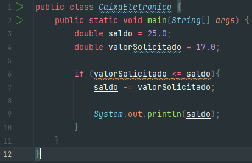
Aqui temos uma estrutura condicional IF simples, que ao ter o resultado da expressão `valorSolicitado <= saldo` verdadeiro, vai executar o bloco de código seguinte.

## Condicional Composta (if-else)

Algumas vezes o nosso programa deverá seguir mais de uma jornada de execução condicionado a uma regra de negócio, este cenário é denominado **Estrutura Condicional Composta**. Vejamos o exemplo abaixo:

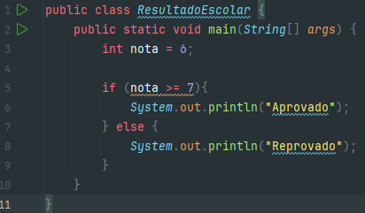
No exemplo acima temos uma estrutura if-else que verifica se a condição da nota do aluno é verdadeira ou falsa. Se (if) verdadeira o aluno estará aprovado, se não (else), o aluno estará reprovado.

## Condicional Escadeada (else-if)

Em um controle de fluxo condicional, nem sempre nos limitamos ao **se** (if) e **senão** (else), poderemos ter uma terceira, quarta e ou inúmeras condições.

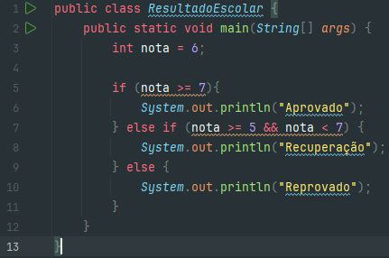
No nosso mesmo algoritmo de `ResultadoEscolar` adicionamos mais uma condicional (else if) para caso o aluno fique com nota entre 5 e 7, que neste caso estará de recuperação.

## Condicional Ternária

Como vimos em operadores, podemos abreviar nosso algoritmo condicional refatorando com o conceito de operador ternário. Vamos refatorar o exemplo acima para ilustrar o poder deste recurso:

### Ternário simples
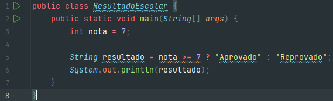
No exemplo acima temos o mesmo algoritmo de **Condicional Simples**, mas que agora não mais necessita de um bloco de código para uma condição que pode ser verdadeira ou falsa.

### Ternário Composto
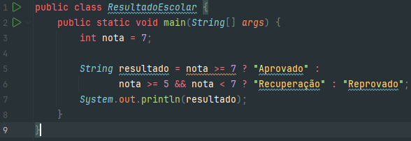
Também podemos utilizar uma estrutura **Condicional Composta** no operador ternário como no exemplo acima. Tal estrurura necessita de um segundo ponto de interrogação para chamar a condicional **If-Else** e assim passar o valor dela caso verdadeira.

## Estrutura Switch Case

A estrutura **switch** compara o valor de cada caso com o da variável sequencialmente, e sempre que encontra um valor correspondente, executa o código associado ao caso. Para evitar que as comparações continuem a ser executadas após um caso correspondente ter sido encontrado, acrescentamos o comando **break** no final de cada bloco de códigos. O comando **break**, quando executado, encerra a execução da estrutura onde ele se econtra.

Vejamos um exemplo:
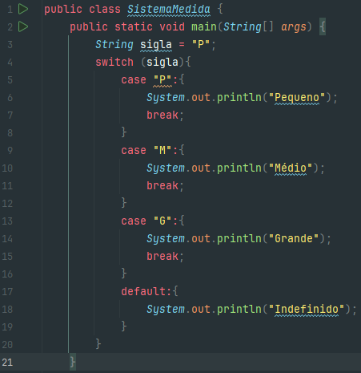
No exemplo acima temos um sistema que retorna o tamanho de acordo com a sigla fornecida. Poderiamos utilizar a estrutura **Else-If** para obter o mesmo resultado, mas deste modo temos de uma maneira mais clara como a estrutura se comporta sem blocos encadeados.

---

# Estruturas de Repetição

Laços de repetição, também conhecidos como laços de iteração ou simplesmente loops, são comandos que permitem iteração de código, ou seja, que comandos presentes no bloco sejam repetidos diversas vezes.

## For

O comando **`for`** permite que uma variável contadora seja testada e incrementada a cada iteração, sendo essas informações definidas na chamada do comando.

A estrutura de sintaxe de controle de repetição **`for`** é exibida abaixo:

    for (bloco de inicialização; expressão booleana de validação; bloco de atualização) {
        Comando que será executado até que
        a expressão de validação torne-se falsa
    }

Vejamos um exemplo de estrutura **for**:

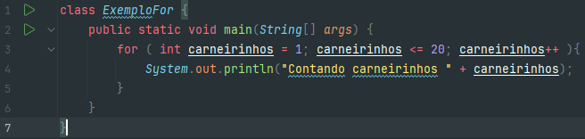
Na imagem acima temos um laço de repetição que conta carneirinhos até que chegue a 20. Observe que a variável `carneirinhos` se inicia com o valor 1 e vai sendo incrementada ao final da chamada do laço em `carneirinhos++`. Tal laço vai imprimir no console o resultado até que a variável chegue na condição `carneirinhos <= 20`.

### For em Arrays

Também utilizamos o controle de fluxo **`for`** para interagir sobre arrays e conleções:

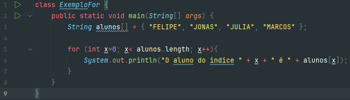
No exemplo acima temos uma estrutura de repetição for que percorre o array `alunos` e imprime no console o aluno correspondente a possição no array determinado por `x`.

### For Each

O uso do **`for / each`** está fortemente relacionado com um cenário onde contenha um array ou coleção, e assim, a interação é baseada nos elementos da coleção.

Vejamos um exemplo:
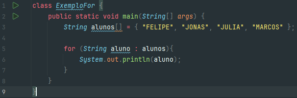
Na imagem acima temos o mesmo array do exemplo anterior, porém, utilizamos a estrutura **For Each** para percorrer o array, onde cada interação será armazenada na variável aluno e para cada elemento presente em alunos, será executado o bloco de código.
Note que na estrutura **For Each** não temos variável de interação, portanto ela depende do tamanho do array.

## Break e Continue

O comando **`break`** interrompe o laço, já o **`continue`** interrompe somente a iteração atual.

Vejamos um exemplo de loop com break:

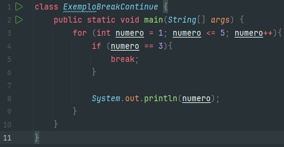
Na imagem acima temos um loop que ao chegar na condicional **if** vai interromper o loop e sair do bloco. Tendo como resultado no console `1 e 2` somente.

Vejamos agora um exemplo de loop com continue:

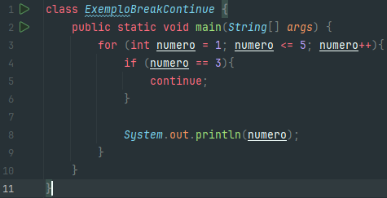
Assim como no exemplo anterior, teremos o mesmo loop, porém, agora temos o continue que ao chegar na condição não executará o bloco de sequencia, mas voltará para o loop de iteração. Portanto o resultado será `1, 2, 4 e 5` não tendo exeutado somente o 3 pois a condicional foi satisfeita.

## While

O laço **`while`** testa uma condição antes de executar o código e enquanto esta condição foi verdadeira o bloco será executado.

A estrutura de sintaxe de controle de repetição **`while`** é exibida abaixo:

    while (expressão booleana de validação){
        comando que será executado até que a
        expressão da validação torne-se falsa
    }

Vejamos um exemplo abaixo:

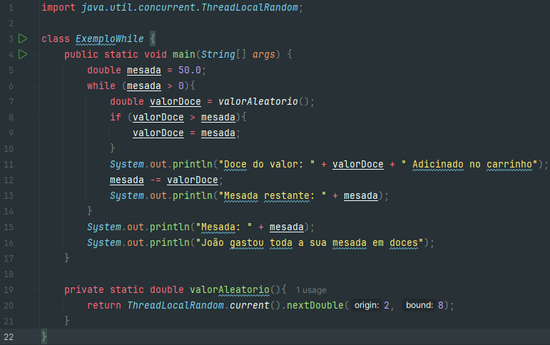
Na imagem acima temos um algoritmo que executará a subtração do `valorDoce` da variável `mesada` enquanto esta tiver valor maior que zero. Fizemos um método `valorAleatorio()` para nos auxiliar a receber um valor de doce entre 2 e 8.

## Do While

O laço **`do / while`** funciona de forma parecida com o laço **`while`**, mas garante que o bloco de código seja executado pelo menos uma vez diante da condição estabelecida.

A estrutura de sintaxe do controle de repetição **`do / while`** é exibida abaixo:

    do {
        comando que será executado até que a 
        expressão de validação torne-se falsa
    } while (expressão booleana de validação);

Vejamos um exemplo abaixo:

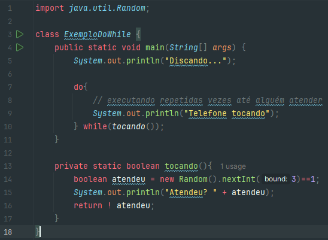
Na imagem acima temos um algoritmo que simula uma ligação. Escrevemos o método `tocando()` que retorna de forma aleatória um valor booleano para caso ele atender o telefone. Observando a estrutura **`do / while`** podemos notar que a linha de comando 9 é executada pelo menos uma vez antes que a condição seja testada.

---